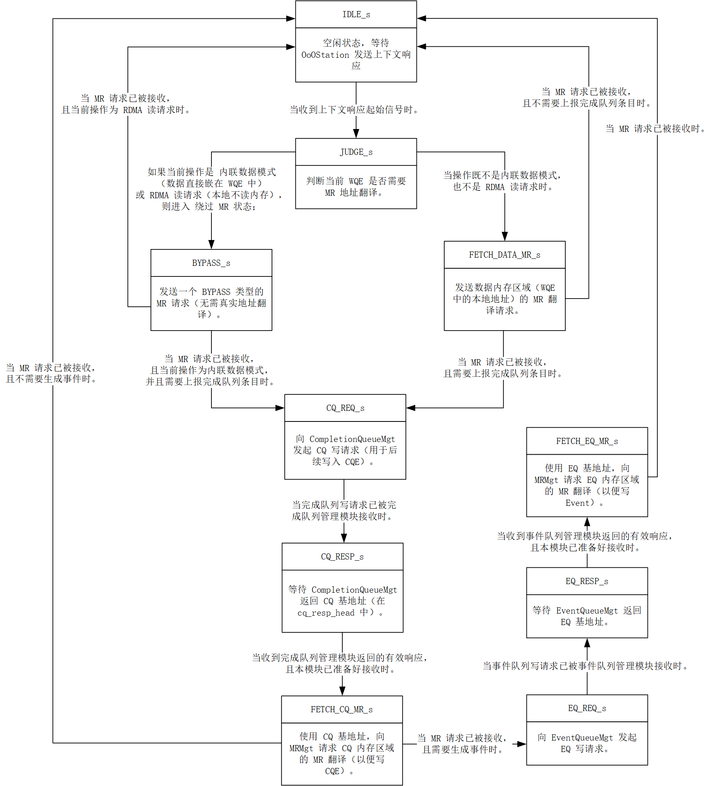

# ReqTransCore\_Thread\_2

## 模块功能

ReqTransCore\_Thread\_2 是协议引擎中一个上下文后处理与内存区域请求生成单元，其核心功能包括：

* 接收来自 OoOStation 的QP/CQ/EQ 上下文和原始 WQE 元数据的上下文响应；
* 解析 WQE 中的 SEND、RDMA\_READ 等操作类型和 RC/UC/UD 服务类型；
* 判断是否需要发起内存区域MR地址翻译请求：
  * Inline 或 RDMA Read：无需访问本地内存发送 BYPASS MR 请求；
  * SEND / RDMA Write 等其他操作：需访问本地数据，发送数据 MR 请求；
* 对于 UC/UD 模式的完成操作，向 CompletionQueueMgt 发起 CQ 请求，获取 CQ 基地址，并发送 CQ MR 请求；
* 支持 Event 上报，向 EventQueueMgt 发起 EQ 请求及 EQ MR 请求；

## 模块接口

<table><thead><tr><th width="206.99996948242188">信号名称</th><th width="87">方向</th><th width="247">位宽</th><th width="151">对接模块</th><th width="247">说明</th></tr></thead><tbody><tr><td>clk</td><td>input</td><td>1</td><td>全局时钟</td><td>上升沿驱动时序逻辑</td></tr><tr><td>rst</td><td>input</td><td>1</td><td>全局复位</td><td>高电平有效同步复位</td></tr><tr><td>fetch_cxt_egress_valid</td><td>input</td><td>1</td><td>OoOStation</td><td>上下文响应有效</td></tr><tr><td>fetch_cxt_egress_head</td><td>input</td><td>TX_REQ_OOO_CXT_EGRESS_HEAD_WIDTH = 672</td><td>OoOStation</td><td>响应头部位宽：QP(416) + CQ(128) + EQ(96) + 通用头(32)</td></tr><tr><td>fetch_cxt_egress_data</td><td>input</td><td>TX_REQ_OOO_CXT_EGRESS_DATA_WIDTH = 576</td><td>OoOStation</td><td>原始 WQE 元数据</td></tr><tr><td>fetch_cxt_egress_start</td><td>input</td><td>1</td><td>OoOStation</td><td>包起始（单拍，恒为1）</td></tr><tr><td>fetch_cxt_egress_last</td><td>input</td><td>1</td><td>OoOStation</td><td>包结束（单拍，恒为1）</td></tr><tr><td>fetch_cxt_egress_ready</td><td>output</td><td>1</td><td>OoOStation</td><td>本模块准备好接收响应</td></tr><tr><td>fetch_mr_ingress_valid</td><td>output</td><td>1</td><td>OoOStation</td><td>MR 请求有效</td></tr><tr><td>fetch_mr_ingress_head</td><td>output</td><td>TX_REQ_OOO_MR_INGRESS_HEAD_WIDTH = 224</td><td>OoOStation</td><td>MR 请求头部位宽：length(32)+laddr(64)+lkey(32)+pd(32)+flags(49)+common(32)</td></tr><tr><td>fetch_mr_ingress_data</td><td>output</td><td>TX_REQ_OOO_MR_INGRESS_DATA_WIDTH = 576</td><td>OoOStation</td><td>含 WQE 字段 + 修改后的 opcode的MR 请求数据</td></tr><tr><td>fetch_mr_ingress_start</td><td>output</td><td>1</td><td>OoOStation</td><td>MR 请求包起始</td></tr><tr><td>fetch_mr_ingress_last</td><td>output</td><td>1</td><td>OoOStation</td><td>MR 请求包结束</td></tr><tr><td>fetch_mr_ingress_ready</td><td>input</td><td>1</td><td>OoOStation</td><td>MRMgt 准备好接收请求</td></tr><tr><td>cq_req_valid</td><td>output</td><td>1</td><td>CompletionQueueMgt</td><td>CQ 请求有效（申请写 CQE）</td></tr><tr><td>cq_req_head</td><td>output</td><td>CQ_REQ_HEAD_WIDTH = 64</td><td>CompletionQueueMgt</td><td>CQ 请求头部位宽：CQ 长度(32) + 保留(8) + CQN(16) + 保留(8)</td></tr><tr><td>cq_req_ready</td><td>input</td><td>1</td><td>CompletionQueueMgt</td><td>CQ 准备好接收请求</td></tr><tr><td>cq_resp_valid</td><td>input</td><td>1</td><td>CompletionQueueMgt</td><td>CQ 响应有效（返回 CQ 基地址）</td></tr><tr><td>cq_resp_head</td><td>input</td><td>CQ_RESP_HEAD_WIDTH = 96</td><td>CompletionQueueMgt</td><td>CQ 响应头部位宽：LADDR(64) + 其他(32)</td></tr><tr><td>cq_resp_ready</td><td>output</td><td>1</td><td>CompletionQueueMgt</td><td>本模块准备好接收 CQ 响应</td></tr><tr><td>eq_req_valid</td><td>output</td><td>1</td><td>EventQueueMgt</td><td>EQ 请求有效（申请写 Event）</td></tr><tr><td>eq_req_head</td><td>output</td><td>EQ_REQ_HEAD_WIDTH = 64</td><td>EventQueueMgt</td><td>EQ 请求头部：EQ 长度(32) + 保留(8) + EQN(16) + 保留(8)</td></tr><tr><td>eq_req_ready</td><td>input</td><td>1</td><td>EventQueueMgt</td><td>EQ 准备好接收请求</td></tr><tr><td>eq_resp_valid</td><td>input</td><td>1</td><td>EventQueueMgt</td><td>EQ 响应有效</td></tr><tr><td>eq_resp_head</td><td>input</td><td>EQ_RESP_HEAD_WIDTH = 96</td><td>EventQueueMgt</td><td>EQ 响应头部：LADDR(64) + 其他(32)</td></tr><tr><td>eq_resp_ready</td><td>output</td><td>1</td><td>EventQueueMgt</td><td>本模块准备好接收 EQ 响应</td></tr></tbody></table>

## 状态机设计

### 状态定义

<table><thead><tr><th width="127">状态名</th><th width="87">编码</th><th width="441.28558349609375">说明</th></tr></thead><tbody><tr><td>IDLE_s</td><td>4'd1</td><td>空闲，等待上下文响应</td></tr><tr><td>JUDGE_s</td><td>4'd2</td><td>解析 WQE 类型</td></tr><tr><td>BYPASS_s</td><td>4'd3</td><td>发送 BYPASS MR 请求（Inline / RDMA Read）</td></tr><tr><td>FETCH_DATA_MR_s</td><td>4'd4</td><td>发送数据 MR 请求（SEND / RDMA Write）</td></tr><tr><td>CQ_REQ_s</td><td>4'd5</td><td>发送 CQ 请求（申请写 CQE）</td></tr><tr><td>CQ_RESP_s</td><td>4'd6</td><td>等待 CQ 响应（获取 CQ 基地址）</td></tr><tr><td>FETCH_CQ_MR_s</td><td>4'd7</td><td>发送 CQ MR 请求（翻译 CQ 地址）</td></tr><tr><td>FETCH_EQ_MR_s</td><td>4'd8</td><td>发送 EQ MR 请求（翻译 EQ 地址）</td></tr><tr><td>EQ_REQ_s</td><td>4'd9</td><td>发送 EQ 请求</td></tr><tr><td>EQ_RESP_s</td><td>4'd10</td><td>等待 EQ 响应</td></tr></tbody></table>

### 状态转移表

<table><thead><tr><th width="127">现态</th><th width="127">次态</th><th width="241.28582763671875">转移条件</th><th width="566.428466796875">转移说明</th></tr></thead><tbody><tr><td>IDLE_s</td><td>JUDGE_s</td><td>fetch_cxt_egress_start == 1</td><td>收到 OoOStation 发来的上下文响应起始信号，开始处理</td></tr><tr><td>JUDGE_s</td><td>BYPASS_s</td><td>is_inline == 1 或 is_rdma_read == 1</td><td>WQE 为 Inline 模式或 RDMA 读请求，无需访问本地内存，跳过地址翻译</td></tr><tr><td>JUDGE_s</td><td>FETCH_DATA_MR_s</td><td>is_inline == 0 且 is_rdma_read == 0</td><td>WQE 需要访问本地内存（如 WQE 操作模式为 SEND、RDMA Write），必须发起数据 MR 地址翻译请求</td></tr><tr><td>BYPASS_s</td><td>IDLE_s</td><td>is_rdma_read == 1 且 fetch_mr_ingress_valid 且 fetch_mr_ingress_ready</td><td>RDMA 读请求的 BYPASS MR 请求已被 MRMgt 接收，直接完成处理</td></tr><tr><td>BYPASS_s</td><td>CQ_REQ_s</td><td>is_inline == 1 且 fetch_mr_ingress_valid且fetch_mr_ingress_ready</td><td>Inline WQE 的 BYPASS MR 请求已被接收，需上报完成状态（CQE）</td></tr><tr><td>BYPASS_s</td><td>BYPASS_s</td><td>fetch_mr_ingress_ready ==0或fetch_mr_ingress_valid==0</td><td>MRMgt 尚未准备好接收 BYPASS MR 请求，持续输出请求并等待握手完成</td></tr><tr><td>FETCH_DATA_MR_s</td><td>CQ_REQ_s</td><td>need_cpl == 1 且 fetch_mr_ingress_valid 且 fetch_mr_ingress_ready</td><td>数据 MR 请求已被接收，且当前操作需要上报 CQE（如 UC/UD 模式下的 SEND）</td></tr><tr><td>FETCH_DATA_MR_s</td><td>IDLE_s</td><td>need_cpl == 0 且 fetch_mr_ingress_valid 且 fetch_mr_ingress_ready</td><td>数据 MR 请求已被接收，且无需上报 CQE（如 RC 模式），直接完成处理</td></tr><tr><td>FETCH_DATA_MR_s</td><td>FETCH_DATA_MR_s</td><td>fetch_mr_ingress_ready ==0或fetch_mr_ingress_valid==0</td><td>MRMgt 尚未准备好接收数据 MR 请求，持续输出请求并等待握手完成</td></tr><tr><td>CQ_REQ_s</td><td>CQ_RESP_s</td><td>cq_req_valid 且 cq_req_ready</td><td>CQ 请求已被 CompletionQueueMgt 接收，等待其返回 CQ 基地址</td></tr><tr><td>CQ_REQ_s</td><td>CQ_REQ_s</td><td>cq_req_valid ==0或 cq_req_ready==0</td><td>CompletionQueueMgt 尚未准备好接收 CQ 请求，持续输出请求并等待握手完成</td></tr><tr><td>CQ_RESP_s</td><td>FETCH_CQ_MR_s</td><td>cq_resp_valid 且 cq_resp_ready</td><td>已收到 CQ 响应（含 CQ 基地址），可发起 CQ 内存区域的 MR 翻译请求</td></tr><tr><td>CQ_RESP_s</td><td>CQ_RESP_s</td><td>cq_resp_valid ==0或cq_resp_ready==0</td><td>尚未收到 CQ 响应，保持 ready 信号高电平，等待 CompletionQueueMgt 返回数据</td></tr><tr><td>FETCH_CQ_MR_s</td><td>EQ_REQ_s</td><td>need_event == 1 且 fetch_mr_ingress_valid 且 fetch_mr_ingress_ready</td><td>CQ MR 请求已被接收，且需要触发 Event</td></tr><tr><td>FETCH_CQ_MR_s</td><td>IDLE_s</td><td>need_event == 0 且 fetch_mr_ingress_valid 且fetch_mr_ingress_ready</td><td>CQ MR 请求已被接收，且无需触发 Event，完成全部流程</td></tr><tr><td>FETCH_CQ_MR_s</td><td>FETCH_CQ_MR_s</td><td>fetch_mr_ingress_valid ==0或fetch_mr_ingress_ready==0</td><td>MRMgt 尚未准备好接收 CQ MR 请求，持续输出请求并等待握手完成</td></tr><tr><td>EQ_REQ_s</td><td>EQ_RESP_s</td><td>eq_req_valid 且eq_req_ready</td><td>EQ 请求已被 EventQueueMgt 接收，等待其返回 EQ 基地址</td></tr><tr><td>EQ_REQ_s</td><td>EQ_REQ_s</td><td>eq_req_valid ==0或&#x26;eq_req_ready==0</td><td>EventQueueMgt 尚未准备好接收 EQ 请求，持续输出请求并等待握手完成</td></tr><tr><td>EQ_RESP_s</td><td>FETCH_EQ_MR_s</td><td>eq_resp_valid &#x26;&#x26; eq_resp_ready</td><td>已收到 EQ 响应（含 EQ 基地址），可发起 EQ 内存区域的 MR 翻译请求</td></tr><tr><td>EQ_RESP_s</td><td>EQ_RESP_s</td><td>eq_resp_valid ==0或 eq_resp_ready==0</td><td>尚未收到 EQ 响应，保持 ready 信号高平，等待 EventQueueMgt 返回数据</td></tr><tr><td>FETCH_EQ_MR_s</td><td>IDLE_s</td><td>fetch_mr_ingress_valid 且fetch_mr_ingress_ready</td><td>EQ MR 请求已被 MRMgt 接收，完成全部流程</td></tr><tr><td>FETCH_EQ_MR_s</td><td>FETCH_EQ_MR_s</td><td>fetch_mr_ingress_valid ==0或fetch_mr_ingress_ready==0</td><td>MRMgt 尚未准备好接收 EQ MR 请求，持续输出请求并等待握手完成</td></tr><tr><td>任意状态</td><td>IDLE_s</td><td>rst == 1</td><td>系统复位，强制回到空闲状态，确保状态机安全初始化</td></tr></tbody></table>

### 状态转移图

<figure><figcaption></figcaption></figure>

## 实现相关

### WQE 字段解析与偏移量说明

WQE 元数据总宽度：576 位（WQE\_META\_WIDTH = 576）

<table><thead><tr><th width="159">字段名称</th><th width="87">位宽</th><th width="107">位偏移范围</th><th width="365.28570556640625">说明</th></tr></thead><tbody><tr><td>local_qpn</td><td>24</td><td>23:0</td><td>本地 QP 编号</td></tr><tr><td>verbs_opcode</td><td>5</td><td>28:24</td><td>Verbs 操作码</td></tr><tr><td>remote_qpn</td><td>24</td><td>55:32</td><td>远端 QP 编号</td></tr><tr><td>net_opcode</td><td>5</td><td>60:56</td><td>网络层操作码</td></tr><tr><td>service_type</td><td>3</td><td>63:61</td><td>服务类型（RC/UC/UD）</td></tr><tr><td>fence</td><td>1</td><td>64</td><td>Fence 标志</td></tr><tr><td>solicited_event</td><td>1</td><td>65</td><td>Solicited Event 标志</td></tr><tr><td>wqe_head</td><td>1</td><td>66</td><td>WQE 头标志</td></tr><tr><td>wqe_tail</td><td>1</td><td>67</td><td>WQE 尾标志</td></tr><tr><td>inline</td><td>1</td><td>68</td><td>是否内联数据</td></tr><tr><td>ori_wqe_offset</td><td>24</td><td>95:72</td><td>原始 WQE 偏移</td></tr><tr><td>dmac</td><td>48</td><td>143:96</td><td>目的 MAC 地址</td></tr><tr><td>smac</td><td>48</td><td>191:144</td><td>源 MAC 地址</td></tr><tr><td>dip</td><td>32</td><td>223:192</td><td>目的 IP 地址</td></tr><tr><td>sip</td><td>32</td><td>255:224</td><td>源 IP 地址</td></tr><tr><td>immediate</td><td>32</td><td>287:256</td><td>立即数</td></tr><tr><td>lkey</td><td>32</td><td>319:288</td><td>本地 Key</td></tr><tr><td>laddr</td><td>64</td><td>383:320</td><td>本地地址</td></tr><tr><td>rkey</td><td>32</td><td>415:384</td><td>远端 Key</td></tr><tr><td>raddr</td><td>64</td><td>479:416</td><td>远端地址</td></tr><tr><td>msg_length</td><td>32</td><td>511:480</td><td>消息长度（字节）</td></tr><tr><td>packet_length</td><td>16</td><td>527:512</td><td>包长度（字节）</td></tr><tr><td>payload_buffer_addr</td><td>32</td><td>575:544</td><td>Payload 缓冲区地址</td></tr></tbody></table>
