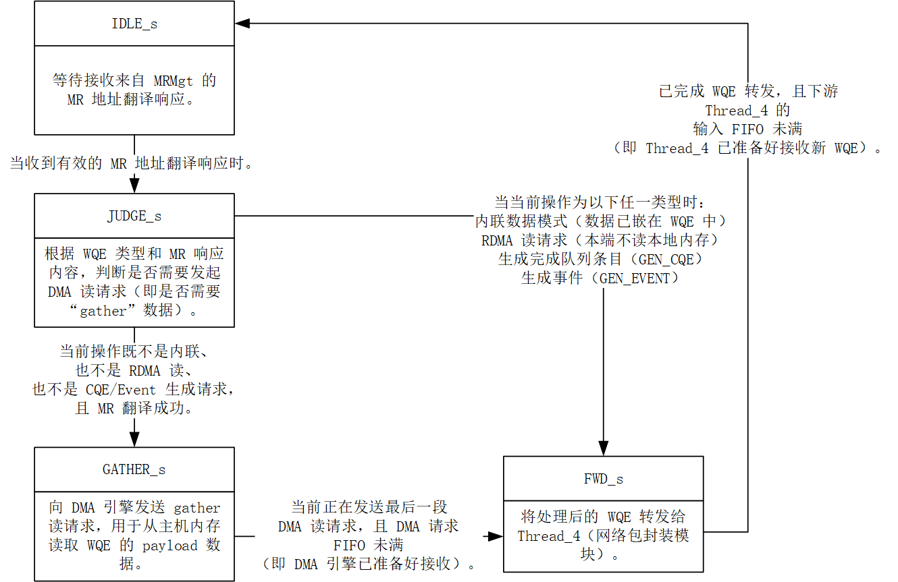

# ReqTransCore\_Thread\_3

## 模块功能

ReqTransCore\_Thread\_3 是协议引擎中的 DMA 读请求生成单元，其核心功能包括：

* 接收来自 OoOStation 的 MR 地址翻译响应和原始 WQE ；
* 判断 WQE 类型，决定是否需要发起 DMA 读请求：无需 DMA：Inline 模式、RDMA Read 请求、CQE/Event 生成请求；需要 DMA：SEND / RDMA Write 等需读取本地 payload 的操作；
* 对于需要 DMA 的 WQE：支持一段或者两端物理地址；向 gather 模块发送包含长度、数据长度、物理地址的读请求；
* 将 原始 WQE 或增强 WQE 转发给 ReqTransCore\_Thread\_4（网络包封装模块）：普通 WQE 原样转发；CQE/Event 请求中，将虚拟地址替换为物理地址；

## 模块接口

<table><thead><tr><th width="175">信号名称</th><th width="87">方向</th><th width="247">位宽</th><th width="271">对接模块</th><th width="247">说明</th></tr></thead><tbody><tr><td>clk</td><td>input</td><td>1</td><td>全局时钟</td><td>上升沿驱动时序逻辑</td></tr><tr><td>rst</td><td>input</td><td>1</td><td>全局复位</td><td>高电平有效同步复位</td></tr><tr><td>fetch_mr_egress_valid</td><td>input</td><td>1</td><td>OoOStation</td><td>MR 响应有效信号</td></tr><tr><td>fetch_mr_egress_head</td><td>input</td><td>TX_REQ_OOO_MR_EGRESS_HEAD_WIDTH = 224</td><td>OoOStation</td><td>MR 响应头部：MR_RESP(224) + EGRESS_COMMON_HEAD(32) </td></tr><tr><td>fetch_mr_egress_data</td><td>input</td><td>TX_REQ_OOO_MR_EGRESS_DATA_WIDTH = 576</td><td>OoOStation</td><td>原始 WQE 元数据</td></tr><tr><td>fetch_mr_egress_start</td><td>input</td><td>1</td><td>OoOStation</td><td>MR 响应包起始（单拍，恒为1）</td></tr><tr><td>fetch_mr_egress_last</td><td>input</td><td>1</td><td>OoOStation</td><td>MR 响应包结束（单拍，恒为1）</td></tr><tr><td>fetch_mr_egress_ready</td><td>output</td><td>1</td><td>OoOStation</td><td>本模块准备好接收 MR 响应</td></tr><tr><td>net_req_wen</td><td>output</td><td>1</td><td>ReqTransCore_Thread_4</td><td>WQE 转发写使能</td></tr><tr><td>net_req_din</td><td>output</td><td>WQE_META_WIDTH = 576</td><td>ReqTransCore_Thread_4</td><td>转发的原始 WQE 或者增强 WQE 数据（普通 WQE 原样，CQE/Event 注入物理地址）</td></tr><tr><td>net_req_prog_full</td><td>input</td><td>1</td><td>ReqTransCore_Thread_4</td><td>Thread_4 的 FIFO 已满</td></tr><tr><td>gather_req_wr_en</td><td>output</td><td>1</td><td>gatherData</td><td>DMA gather 请求写使能</td></tr><tr><td>gather_req_din</td><td>output</td><td>DMA_LENGTH_WIDTH * 2 + DMA_ADDR_WIDTH = 32 * 2 + 64 = 128</td><td>gatherData</td><td>DMA 请求数据,组成结构为{packet_length(16), size0(32), phy_addr0(64)} 或 {packet_length(16), size1(32), phy_addr1(64)}，高位补0</td></tr><tr><td>gather_req_prog_full</td><td>input</td><td>1</td><td>gatherData</td><td>DMA 请求 FIFO 已满</td></tr></tbody></table>

## 状态机设计

### 状态说明

<table><thead><tr><th width="87">状态名</th><th width="87">编码</th><th width="328.71435546875">说明</th></tr></thead><tbody><tr><td>IDLE_s</td><td>3'd1</td><td>空闲状态，等待 MR 响应</td></tr><tr><td>JUDGE_s</td><td>3'd2</td><td>判断是否需要发起 DMA 读请求</td></tr><tr><td>GATHER_s</td><td>3'd3</td><td>发送 DMA gather 读请求（1段或2段）</td></tr><tr><td>FWD_s</td><td>3'd4</td><td>向 Thread_4 转发 WQE</td></tr></tbody></table>

### 状态转移表

<table><thead><tr><th width="87">现态</th><th width="87">次态</th><th width="247">转移条件</th><th width="376.7142333984375">中文说明</th></tr></thead><tbody><tr><td>IDLE_s</td><td>JUDGE_s</td><td>fetch_mr_egress_valid == 1</td><td>收到 MR 响应，开始处理</td></tr><tr><td>IDLE_s</td><td>IDLE_s</td><td>fetch_mr_egress_valid == 0</td><td>未收到 MR 响应，保持空闲</td></tr><tr><td>JUDGE_s</td><td>FWD_s</td><td>no_gather == 1</td><td>无需 DMA（ WQE 操作类型为 Inline / RDMA Read / CQE / Event），直接转发 WQE</td></tr><tr><td>JUDGE_s</td><td>GATHER_s</td><td>no_gather == 0</td><td>需要 DMA（WQE 操作类型为 SEND / RDMA Write），进入 gather 状态</td></tr><tr><td>GATHER_s</td><td>FWD_s</td><td>data_piece_left == 1 且 gather_req_prog_full == 0</td><td>最后一段 DMA 请求已发送且 DMA FIFO 未满，转为转发 WQE</td></tr><tr><td>GATHER_s</td><td>GATHER_s</td><td>gather_req_prog_full == 1  data_piece_left > 1</td><td>DMA FIFO 满或仍有段未发送，继续等待或发送</td></tr><tr><td>FWD_s</td><td>IDLE_s</td><td>net_req_prog_full == 0</td><td>Thread_4 FIFO 未满，WQE 转发完成，回到空闲</td></tr><tr><td>FWD_s</td><td>FWD_s</td><td>net_req_prog_full == 1</td><td>Thread_4 FIFO 满，等待其 ready</td></tr><tr><td>任意状态</td><td>IDLE_s</td><td>rst == 1</td><td>复位，强制回到空闲</td></tr></tbody></table>

### 状态转移图

<figure><figcaption></figcaption></figure>
