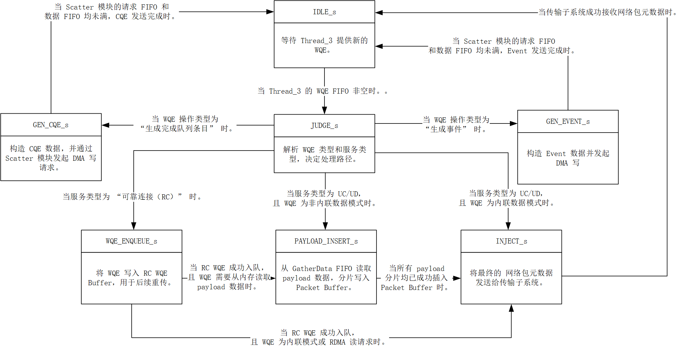

# ReqTransCore\_Thread\_4

ReqTransCore\_Thread\_4 是网络包注入与完成上报单元，其核心功能包括：

* 接收来自 ReqTransCore\_Thread\_3 含物理地址的增强 WQE；
* 根据服务类型（RC/UC/UD）和操作码，执行不同处理路径：
  * RC 模式：将 WQE 入队到用于重传 RC WQE Buffer；
  * UC/UD 模式：
    * Inline：直接组包注入；
    * 非 Inline：从 GatherData 读取 payload 数据，分片插入 Packet Buffer；
* 生成 网络包元数据（含 payload buffer 地址），注入 传输子系统；
* 处理 GEN\_CQE / GEN\_EVENT 请求：
  * 构造 CQE/Event 数据；
  * 向 Scatter 模块 发起 DMA 写请求，将完成信息写回主机内存。

## 模块接口

<table><thead><tr><th width="183">信号名称</th><th width="87">方向</th><th width="247">位宽</th><th width="175">对接模块</th><th width="247">说明</th></tr></thead><tbody><tr><td>clk</td><td>input</td><td>1</td><td>全局时钟</td><td>上升沿驱动时序逻辑</td></tr><tr><td>rst</td><td>input</td><td>1</td><td>全局复位</td><td>高电平有效同步复位</td></tr><tr><td>net_req_ren</td><td>output</td><td>1</td><td>ReqTransCore_Thread_3</td><td>请求 Thread_3 发送下一条 WQE</td></tr><tr><td>net_req_dout</td><td>input</td><td>WQE_META_WIDTH = 576</td><td>ReqTransCore_Thread_3</td><td>增强 WQE 数据（含物理地址）</td></tr><tr><td>net_req_empty</td><td>input</td><td>1</td><td>ReqTransCore_Thread_3</td><td>Thread_3 FIFO 为空标志</td></tr><tr><td>net_data_rd_en</td><td>output</td><td>1</td><td>GatherData</td><td>请求 GatherData 发送 payload 数据</td></tr><tr><td>net_data_dout</td><td>input</td><td>DMA_DATA_WIDTH = 512</td><td>GatherData</td><td>payload 数据（64 字节分片）</td></tr><tr><td>net_data_empty</td><td>input</td><td>1</td><td>GatherData</td><td>GatherData FIFO 为空标志</td></tr><tr><td>scatter_req_wen</td><td>output</td><td>1</td><td>Scatter 模块</td><td>Scatter 请求写使能</td></tr><tr><td>scatter_req_din</td><td>output</td><td>DMA_LENGTH_WIDTH * 2 + DMA_ADDR_WIDTH = 32 * 2 + 64 = 128</td><td>Scatter 模块</td><td>Scatter 请求，结构组成为：{CQE_LENGTH, CQE_LENGTH, phy_addr}</td></tr><tr><td>scatter_req_prog_full</td><td>input</td><td>1</td><td>Scatter 模块</td><td>Scatter 请求 FIFO 已满</td></tr><tr><td>scatter_data_wen</td><td>output</td><td>1</td><td>Scatter 模块</td><td>Scatter 数据写使能</td></tr><tr><td>scatter_data_din</td><td>output</td><td>DMA_DATA_WIDTH = 512</td><td>Scatter 模块</td><td>CQE/Event 数据内容</td></tr><tr><td>scatter_data_prog_full</td><td>input</td><td>1</td><td>Scatter 模块</td><td>Scatter 数据 FIFO 已满</td></tr><tr><td>enqueue_req_valid</td><td>output</td><td>1</td><td>RC WQE Buffer</td><td>RC WQE 入队请求有效</td></tr><tr><td>enqueue_req_head</td><td>output</td><td>MAX_QP_NUM_LOG + MAX_DMQ_SLOT_NUM_LOG = 8 + 15 = 23</td><td>RC WQE Buffer</td><td>WQE 队列头，结构组成为：{valid, QPN}</td></tr><tr><td>enqueue_req_data</td><td>output</td><td>RC_WQE_BUFFER_SLOT_WIDTH = 256</td><td>RC WQE Buffer</td><td>WQE 数据</td></tr><tr><td>enqueue_req_start</td><td>output</td><td>1</td><td>RC WQE Buffer</td><td>WQE 包起始（单拍，恒为1）</td></tr><tr><td>enqueue_req_last</td><td>output</td><td>1</td><td>RC WQE Buffer</td><td>WQE 包结束（单拍，恒为1）</td></tr><tr><td>enqueue_req_ready</td><td>input</td><td>1</td><td>RC WQE Buffer</td><td>RC WQE Buffer 准备好接收</td></tr><tr><td>insert_req_valid</td><td>output</td><td>1</td><td>Packet Buffer</td><td>Payload 插入请求有效</td></tr><tr><td>insert_req_start</td><td>output</td><td>1</td><td>Packet Buffer</td><td>Payload 第一片标志</td></tr><tr><td>insert_req_last</td><td>output</td><td>1</td><td>Packet Buffer</td><td>Payload 最后一片标志</td></tr><tr><td>insert_req_head</td><td>output</td><td>MAX_DB_SLOT_NUM_LOG = 16</td><td>Packet Buffer</td><td>Payload 总分片数</td></tr><tr><td>insert_req_data</td><td>output</td><td>PACKET_BUFFER_SLOT_WIDTH = 512</td><td>Packet Buffer</td><td>Payload 数据（64 字节分片）</td></tr><tr><td>insert_req_ready</td><td>input</td><td>1</td><td>Packet Buffer</td><td>Packet Buffer 准备好接收</td></tr><tr><td>insert_resp_valid</td><td>input</td><td>1</td><td>Packet Buffer</td><td>Packet Buffer 插入响应有效</td></tr><tr><td>insert_resp_data</td><td>input</td><td>MAX_DB_SLOT_NUM_LOG = 16</td><td>Packet Buffer</td><td>分配的 payload buffer 起始地址</td></tr><tr><td>egress_pkt_valid</td><td>output</td><td>1</td><td>传输子系统</td><td>网络包注入有效</td></tr><tr><td>egress_pkt_head</td><td>output</td><td>PKT_META_BUS_WIDTH = 488</td><td>传输子系统</td><td>网络包元数据（含 payload 地址、QPN、opcode、IP/MAC 等）</td></tr><tr><td>egress_pkt_ready</td><td>input</td><td>1</td><td>传输子系统</td><td>传输子系统准备好接收</td></tr></tbody></table>

## 状态机设计

### 状态说明

<table><thead><tr><th width="135">状态名</th><th width="87">编码</th><th width="364.1427001953125">说明</th></tr></thead><tbody><tr><td>IDLE_s</td><td>4'd1</td><td>空闲状态，等待 WQE 到来</td></tr><tr><td>JUDGE_s</td><td>4'd2</td><td>判断 WQE 类型（RC/UC/UD/CQE）</td></tr><tr><td>WQE_ENQUEUE_s</td><td>4'd3</td><td>RC WQE 入队到 RC WQE Buffer</td></tr><tr><td>PAYLOAD_INSERT_s</td><td>4'd4</td><td>非 Inline payload 分片插入</td></tr><tr><td>GEN_CQE_s</td><td>4'd5</td><td>生成 CQE 并发起 DMA 写</td></tr><tr><td>GEN_EVENT_s</td><td>4'd6</td><td>生成 Event</td></tr><tr><td>INJECT_s</td><td>4'd7</td><td>网络包注入传输子系统</td></tr></tbody></table>

### 状态转移表

<table><thead><tr><th width="135">现态</th><th width="135">次态</th><th width="247">转移条件</th><th width="247">中文说明</th></tr></thead><tbody><tr><td>IDLE_s</td><td>JUDGE_s</td><td>net_req_empty == 0</td><td>收到 Thread_3 的 WQE，开始处理</td></tr><tr><td>IDLE_s</td><td>IDLE_s</td><td>net_req_empty == 1</td><td>未收到 WQE，保持空闲</td></tr><tr><td>JUDGE_s</td><td>GEN_CQE_s</td><td>NetReq_net_opcode == ``GEN_CQE"</td><td>CQE 生成请求</td></tr><tr><td>JUDGE_s</td><td>GEN_EVENT_s</td><td>NetReq_net_opcode == ``GEN_EVENT"</td><td>Event 生成请求</td></tr><tr><td>JUDGE_s</td><td>WQE_ENQUEUE_s</td><td>NetReq_service_type == ``R''</td><td>RC 模式，进入 WQE 入队状态</td></tr><tr><td>JUDGE_s</td><td>INJECT_s</td><td>(NetReq_service_type == ``UC` || `NetReq_service_type == ``UD`) &#x26;&#x26; `NetReq_inline == 1</td><td>UC/UD Inline 模式，直接发送到传输子系统</td></tr><tr><td>JUDGE_s</td><td>PAYLOAD_INSERT_s</td><td>(NetReq_service_type == ``UC` || `NetReq_service_type == ``UD`) &#x26;&#x26; `NetReq_inline == 0</td><td>UC/UD 非 Inline 模式，进入 payload 插入</td></tr><tr><td>WQE_ENQUEUE_s</td><td>INJECT_s</td><td>enqueue_req_valid &#x26;&#x26; enqueue_req_ready &#x26;&#x26; (NetReq_inline == 1 || is_rdma_read == 1)</td><td>RC WQE 入队完成，且 无需 payload（ WQE 操作类型为Inline 或 RDMA Read）</td></tr><tr><td>WQE_ENQUEUE_s</td><td>PAYLOAD_INSERT_s</td><td>enqueue_req_valid &#x26;&#x26; enqueue_req_ready &#x26;&#x26; (NetReq_inline == 0 &#x26;&#x26; is_rdma_read == 0)</td><td>RC WQE 入队完成，且 需要 payload（ WQE 操作类型为非 Inline 且非 RDMA Read）</td></tr><tr><td>WQE_ENQUEUE_s</td><td>WQE_ENQUEUE_s</td><td>!(enqueue_req_valid &#x26;&#x26; enqueue_req_ready)</td><td>等待 RC WQE Buffer ready，当前握手未完成</td></tr><tr><td>PAYLOAD_INSERT_s</td><td>INJECT_s</td><td>!net_data_empty &#x26;&#x26; insert_req_valid &#x26;&#x26; insert_req_ready &#x26;&#x26; insert_resp_valid &#x26;&#x26; (payload_piece_count == payload_piece_total)</td><td>
所有条件满足：GatherData 有数据， 插入请求有效，Packet Buffer ready， 收到地址响应

 所有分片已插入
</td></tr><tr><td>PAYLOAD_INSERT_s</td><td>PAYLOAD_INSERT_s</td><td>!(!net_data_empty &#x26;&#x26; insert_req_valid &#x26;&#x26; insert_req_ready &#x26;&#x26; insert_resp_valid &#x26;&#x26; (payload_piece_count == payload_piece_total))</td><td>继续插入分片或等待任一条件满足</td></tr><tr><td>GEN_CQE_s</td><td>IDLE_s</td><td>!scatter_req_prog_full &#x26;&#x26; !scatter_data_prog_full</td><td>Scatter 请求和数据 FIFO 均未满，CQE 发送完成</td></tr><tr><td>GEN_CQE_s</td><td>GEN_CQE_s</td><td>scatter_req_prog_full == 1 || scatter_data_prog_full == 1</td><td>等待 Scatter FIFO ready</td></tr><tr><td>GEN_EVENT_s</td><td>IDLE_s</td><td>!scatter_req_prog_full &#x26;&#x26; !scatter_data_prog_full</td><td>Event 发送完成</td></tr><tr><td>GEN_EVENT_s</td><td>GEN_EVENT_s</td><td>scatter_req_prog_full == 1 || scatter_data_prog_full == 1</td><td>等待 Scatter FIFO ready</td></tr><tr><td>INJECT_s</td><td>IDLE_s</td><td>egress_pkt_valid &#x26;&#x26; egress_pkt_ready</td><td>传输子系统接收网络包，完成注入</td></tr><tr><td>INJECT_s</td><td>INJECT_s</td><td>!(egress_pkt_valid &#x26;&#x26; egress_pkt_ready)</td><td>等待传输子系统 ready</td></tr><tr><td>任意状态</td><td>IDLE_s</td><td>rst == 1</td><td>复位，强制回到空闲</td></tr></tbody></table>

### 状态转移图

<figure><figcaption></figcaption></figure>

## 设计实现

### Payload 分片时序图

假设 payload 长度 = 1500 字节（需 24 片，每片 64 字节）：

<table><thead><tr><th width="87">时钟周期</th><th width="207">Thread_4 状态</th><th width="184.71429443359375">insert_req_valid</th><th width="180.1429443359375">insert_req_start</th><th width="127">insert_req_last</th><th width="207">insert_req_data（示例）</th><th width="247">Packet Buffer：insert_req_ready</th><th width="277.28570556640625">Packet Buffer：insert_resp_valid</th><th width="281.28582763671875">Packet Buffer：insert_resp_data</th><th width="247">关键说明</th></tr></thead><tbody><tr><td>T0</td><td>PAYLOAD_INSERT_s</td><td>1</td><td>1</td><td>0</td><td>片0（64字节）</td><td>1</td><td>0</td><td>-</td><td>发送第一片：start=1表示 payload 起始 数据 = payload 前 64 字节</td></tr><tr><td>T1</td><td>PAYLOAD_INSERT_s</td><td>-</td><td>-</td><td>-</td><td>-</td><td>-</td><td>1</td><td>0x1000</td><td>返回起始地址： Packet Buffer 分配连续内存- 返回起始地址 0x1000 后续分片将顺序写入 0x1000+64, 0x1000+128...</td></tr><tr><td>T2</td><td>PAYLOAD_INSERT_s</td><td>1</td><td>0</td><td>0</td><td>片1（64字节）</td><td>1</td><td>0</td><td>-</td><td>发送第二片：start=0, last=0 表示中间分片 数据 = payload 第 64~127 字节</td></tr><tr><td>T3</td><td>PAYLOAD_INSERT_s</td><td>1</td><td>0</td><td>0</td><td>片2（64字节）</td><td>1</td><td>0</td><td>-</td><td>发送第三片： 继续顺序写入</td></tr><tr><td>...</td><td>...</td><td>...</td><td>...</td><td>...</td><td>...</td><td>...</td><td>...</td><td>...</td><td>中间分片： 持续发送直到最后一片</td></tr><tr><td>T24</td><td>PAYLOAD_INSERT_s</td><td>1</td><td>0</td><td>1</td><td>片23（64字节）</td><td>1</td><td>0</td><td>-</td><td>发送最后一片：last=1 表示 payload 结束 payload 总长度 = 24 × 64 = 1536 字节（>1500，末尾补0）</td></tr><tr><td>T25</td><td>INJECT_s</td><td>0</td><td>0</td><td>0</td><td>-</td><td>-</td><td>-</td><td>-</td><td>状态跳转： Thread_4 检测到 payload_piece_count == payload_piece_total 跳转到 INJECT_s 状态 使用地址 0x1000 构造网络包</td></tr></tbody></table>

分片规则：

* 分片大小：64 字节（= DMA\_DATA\_WIDTH = 512 位）；
* 总分片数：payload\_piece\_total = (packet\_length + 63) / 64（向上取整）；
* 末尾补0：若 payload 长度非 64 的整数倍，最后一片末尾补 0。

地址分配：

* 仅第一片返回地址：insert\_resp\_valid=1 仅在 T1 有效；
* 地址连续性：Packet Buffer 保证分片写入连续内存；
* 传输子系统使用：egress\_pkt\_head 中的 payload\_buffer\_addr 。

状态机控制：

* 计数器：payload\_piece\_count 从 1 开始，每成功插入一片 +1；
* 完成条件：payload\_piece\_count == payload\_piece\_total 且 insert\_resp\_valid=1；
* 流控：insert\_req\_ready=0 时，Thread\_4 保持当前状态（不发送新分片）。

信号说明：

* -：信号值无关紧要（或保持上一周期值）；
* start/last：
  * start=1：第一片（分配地址）；
  * last=1：最后一片（完成标志）。
