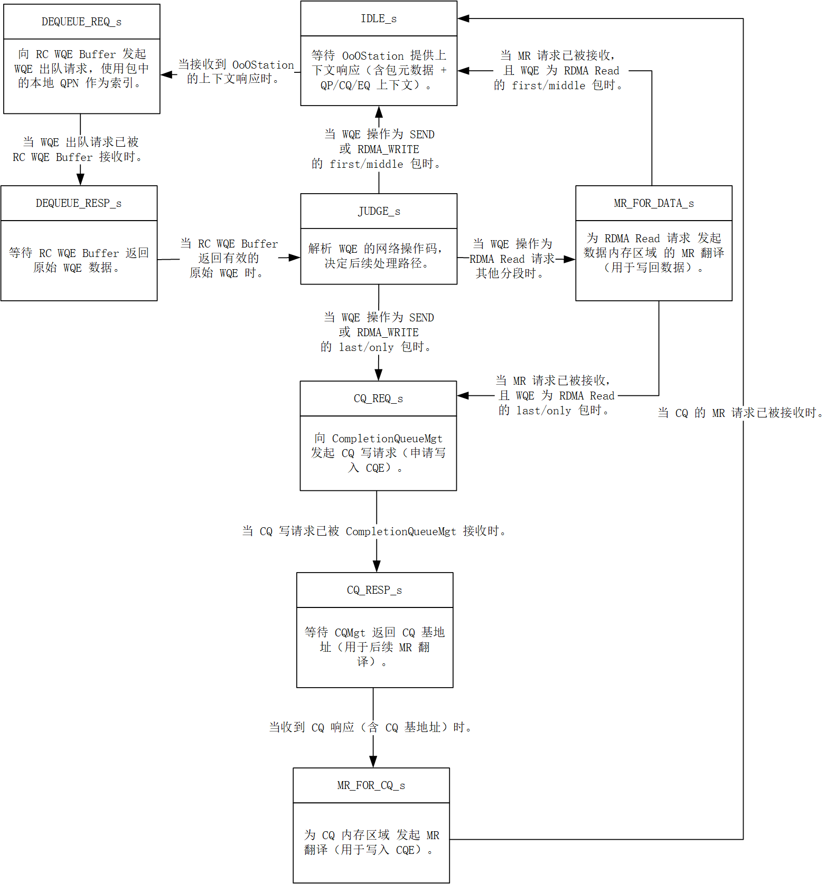

# RespRecvCore\_Thread\_2

## 模块功能

* 接收来自 OoOStation 的 QP 上下文响应；
* 根据包中的 QP 号，向 WQEBuffer 查询对应的原始 WQE；
* 根据 WQE 中的操作码判断操作类型：
  * 若为 RDMA Read Response，则查询 MR 以写入 payload 数据；
  * 若为 Send/RDMA Write 的结束包，则生成 CQE；
  * 若需报告错误，则生成 EQE；
* 向 MRMgt 发起 MR 查询，获取内存地址和权限；
* 向 CompletionQueueMgt 或 EventQueueMgt 发起 CQE/EQE 写请求。

## 模块接口

<table><thead><tr><th width="183">信号名称</th><th width="87">方向</th><th width="87">位宽</th><th width="151">对接模块</th><th width="247">说明</th></tr></thead><tbody><tr><td>clk</td><td>input</td><td>1</td><td>全局时钟</td><td>上升沿驱动</td></tr><tr><td>rst</td><td>input</td><td>1</td><td>全局复位</td><td>同步高有效复位</td></tr><tr><td>fetch_cxt_egress_valid</td><td>input</td><td>1</td><td>OoOStation</td><td>CXT 响应有效</td></tr><tr><td>fetch_cxt_egress_head</td><td>input</td><td>672</td><td>OoOStation</td><td>CXT 响应头</td></tr><tr><td>fetch_cxt_egress_data</td><td>input</td><td>488</td><td>OoOStation</td><td>原始包头</td></tr><tr><td>fetch_cxt_egress_start</td><td>input</td><td>1</td><td>OoOStation</td><td>分段起始（本设计恒为 1）</td></tr><tr><td>fetch_cxt_egress_last</td><td>input</td><td>1</td><td>OoOStation</td><td>分段结束（本设计恒为 1）</td></tr><tr><td>fetch_cxt_egress_ready</td><td>output</td><td>1</td><td>OoOStation</td><td>本模块就绪接收 CXT</td></tr><tr><td>fetch_mr_ingress_valid</td><td>output</td><td>1</td><td>OoOStation</td><td>MR 查询请求有效</td></tr><tr><td>fetch_mr_ingress_head</td><td>output</td><td>544</td><td>OoOStation</td><td>MR 请求头</td></tr><tr><td>fetch_mr_ingress_data</td><td>output</td><td>256</td><td>OoOStation</td><td>MR 附带数据</td></tr><tr><td>fetch_mr_ingress_start</td><td>output</td><td>1</td><td>OoOStation</td><td>分段起始（本设计恒为 1）</td></tr><tr><td>fetch_mr_ingress_last</td><td>output</td><td>1</td><td>OoOStation</td><td>分段结束（本设计恒为 1）</td></tr><tr><td>fetch_mr_ingress_ready</td><td>input</td><td>1</td><td>OoOStation</td><td>OoOStation 就绪接收 MR 请求</td></tr><tr><td>dequeue_req_valid</td><td>output</td><td>1</td><td>WQEBuffer</td><td>WQE 弹出请求有效</td></tr><tr><td>dequeue_req_head</td><td>output</td><td>31</td><td>WQEBuffer</td><td>WQE 弹出请求头</td></tr><tr><td>dequeue_req_ready</td><td>input</td><td>1</td><td>WQEBuffer</td><td>WQEBuffer 就绪</td></tr><tr><td>dequeue_resp_valid</td><td>input</td><td>1</td><td>WQEBuffer</td><td>WQE 响应有效</td></tr><tr><td>dequeue_resp_head</td><td>input</td><td>31</td><td>WQEBuffer</td><td>用于匹配请求</td></tr><tr><td>dequeue_resp_start</td><td>input</td><td>1</td><td>WoOStation</td><td>分段起始</td></tr><tr><td>dequeue_resp_last</td><td>input</td><td>1</td><td>WQEBuffer</td><td>分段结束</td></tr><tr><td>dequeue_resp_ready</td><td>output</td><td>1</td><td>WQEBuffer</td><td>本模块就绪接收 WQE</td></tr><tr><td>dequeue_resp_data</td><td>input</td><td>256</td><td>WQEBuffer</td><td>WQE 实际数据</td></tr><tr><td>cq_req_valid</td><td>output</td><td>1</td><td>CompletionQueueMgt</td><td>CQ 写请求有效</td></tr><tr><td>cq_req_head</td><td>output</td><td>64</td><td>CompletionQueueMgt</td><td>CQ 请求头</td></tr><tr><td>cq_req_ready</td><td>input</td><td>1</td><td>CompletionQueueMgt</td><td>CQ 管理器就绪</td></tr><tr><td>cq_resp_valid</td><td>input</td><td>1</td><td>CompletionQueueMgt</td><td>CQ 响应有效</td></tr><tr><td>cq_resp_head</td><td>input</td><td>96</td><td>CompletionQueueMgt</td><td>CQ 响应头</td></tr><tr><td>cq_resp_ready</td><td>output</td><td>1</td><td>CompletionQueueMgt</td><td>本模块就绪接收 CQ 响应</td></tr><tr><td>eq_req_valid</td><td>output</td><td>1</td><td>EventQueueMgt</td><td>EQ 写请求有效</td></tr><tr><td>eq_req_head</td><td>output</td><td>64</td><td>EventQueueMgt</td><td>EQ 请求头</td></tr><tr><td>eq_req_ready</td><td>input</td><td>1</td><td>EventQueueMgt</td><td>EQ 管理器就绪</td></tr><tr><td>eq_resp_valid</td><td>input</td><td>1</td><td>EventQueueMgt</td><td>EQ 响应有效</td></tr><tr><td>eq_resp_head</td><td>input</td><td>96</td><td>EventQueueMgt</td><td>EQ 响应头</td></tr><tr><td>eq_resp_ready</td><td>output</td><td>1</td><td>EventQueueMgt</td><td>本模块就绪接收 EQ 响应</td></tr></tbody></table>

## 状态机设计

### 状态说明

<table><thead><tr><th width="119">状态名</th><th width="87">编码</th><th width="461.2857666015625">说明</th></tr></thead><tbody><tr><td>IDLE_s</td><td>4'd1</td><td>空闲态：等待 CXT 响应</td></tr><tr><td>DEQUEUE_REQ_s</td><td>4'd2</td><td>请求 WQE：向 WQEBuffer 发请求</td></tr><tr><td>DEQUEUE_RESP_s</td><td>4'd3</td><td>等待 WQE 响应</td></tr><tr><td>JUDGE_s</td><td>4'd4</td><td>判定操作类型</td></tr><tr><td>CQ_REQ_s</td><td>4'd5</td><td>请求写 CQE</td></tr><tr><td>CQ_RESP_s</td><td>4'd6</td><td>等待 CQ 响应（获取写入地址）</td></tr><tr><td>EQ_REQ_s</td><td>4'd7</td><td>请求写 EQE</td></tr><tr><td>EQ_RESP_s</td><td>4'd8</td><td>等待 EQ 响应</td></tr><tr><td>MR_FOR_DATA_s</td><td>4'd9</td><td>为数据 payload 查 MR</td></tr><tr><td>MR_FOR_CQ_s</td><td>4'd10</td><td>为 CQ 写入查 MR</td></tr><tr><td>MR_FOR_EQ_s</td><td>4'd11</td><td>为 EQ 写入查 MR</td></tr></tbody></table>

### 状态转移表

<table><thead><tr><th width="119">现态</th><th width="119">次态</th><th width="247">转移条件</th><th width="247">说明</th></tr></thead><tbody><tr><td>IDLE_s</td><td>DEQUEUE_REQ_s</td><td>fetch_cxt_egress_valid == 1</td><td>收到 CXT 响应，开始处理</td></tr><tr><td>IDLE_s</td><td>IDLE_s</td><td>fetch_cxt_egress_valid == 0</td><td>无 CXT，保持空闲</td></tr><tr><td>DEQUEUE_REQ_s</td><td>DEQUEUE_RESP_s</td><td>无条件</td><td>发出 WQE 请求后立即进入等待</td></tr><tr><td>DEQUEUE_RESP_s</td><td>JUDGE_s</td><td>dequeue_resp_valid == 1</td><td>收到 WQE，进入判定</td></tr><tr><td>DEQUEUE_RESP_s</td><td>DEQUEUE_RESP_s</td><td>dequeue_resp_valid == 0</td><td>未收到 WQE，继续等待</td></tr><tr><td>JUDGE_s</td><td>CQ_REQ_s</td><td>WQE_net_opcode 为 Send/Write 结束包</td><td>需生成 CQE</td></tr><tr><td>JUDGE_s</td><td>IDLE_s</td><td>WQE_net_opcode 为 Send/Write 中间包</td><td>无需 CQE，直接结束</td></tr><tr><td>JUDGE_s</td><td>MR_FOR_DATA_s</td><td>WQE_net_opcode 为 RDMA_READ_REQUEST_*</td><td>需写数据，查 MR</td></tr><tr><td>JUDGE_s</td><td>IDLE_s</td><td>其他 opcode</td><td>未知包，直接结束</td></tr><tr><td>CQ_REQ_s</td><td>CQ_RESP_s</td><td>cq_req_valid &#x26;&#x26; cq_req_ready</td><td>CQ 请求被接收</td></tr><tr><td>CQ_REQ_s</td><td>CQ_REQ_s</td><td>!(cq_req_valid &#x26;&#x26; cq_req_ready)</td><td>继续尝试发送 CQ 请求</td></tr><tr><td>CQ_RESP_s</td><td>MR_FOR_CQ_s</td><td>cq_resp_valid &#x26;&#x26; cq_resp_ready</td><td>收到 CQ 响应，查 MR</td></tr><tr><td>CQ_RESP_s</td><td>CQ_RESP_s</td><td>!(cq_resp_valid &#x26;&#x26; cq_resp_ready)</td><td>继续等待 CQ 响应</td></tr><tr><td>EQ_REQ_s</td><td>EQ_RESP_s</td><td>eq_req_valid &#x26;&#x26; eq_req_ready</td><td>EQ 请求被接收</td></tr><tr><td>EQ_REQ_s</td><td>EQ_REQ_s</td><td>!(eq_req_valid &#x26;&#x26; eq_req_ready)</td><td>继续尝试发送 EQ 请求</td></tr><tr><td>EQ_RESP_s</td><td>MR_FOR_EQ_s</td><td>eq_resp_valid &#x26;&#x26; eq_resp_ready</td><td>收到 EQ 响应，查 MR</td></tr><tr><td>EQ_RESP_s</td><td>EQ_RESP_s</td><td>!(eq_resp_valid &#x26;&#x26; eq_resp_ready)</td><td>继续等待 EQ 响应</td></tr><tr><td>MR_FOR_DATA_s</td><td>CQ_REQ_s</td><td>fetch_mr_ingress_valid &#x26;&#x26; fetch_mr_ingress_ready &#x26;&#x26; (WQE 为 Read 最后包)</td><td>Read 最后包需生成 CQE</td></tr><tr><td>MR_FOR_DATA_s</td><td>IDLE_s</td><td>fetch_mr_ingress_valid &#x26;&#x26; fetch_mr_ingress_ready &#x26;&#x26; (WQE 非最后包)</td><td>Read 中间包，直接结束</td></tr><tr><td>MR_FOR_DATA_s</td><td>MR_FOR_DATA_s</td><td>MR 请求未被接收</td><td>继续等待 MR 请求被接收</td></tr><tr><td>MR_FOR_CQ_s</td><td>IDLE_s</td><td>fetch_mr_ingress_valid &#x26;&#x26; fetch_mr_ingress_ready</td><td>CQ 的 MR 查完，结束</td></tr><tr><td>MR_FOR_CQ_s</td><td>MR_FOR_CQ_s</td><td>!(fetch_mr_ingress_valid &#x26;&#x26; fetch_mr_ingress_ready)</td><td>继续等待 MR 请求</td></tr><tr><td>MR_FOR_EQ_s</td><td>IDLE_s</td><td>fetch_mr_ingress_valid &#x26;&#x26; fetch_mr_ingress_ready</td><td>EQ 的 MR 查完，结束</td></tr><tr><td>MR_FOR_EQ_s</td><td>MR_FOR_EQ_s</td><td>!(fetch_mr_ingress_valid &#x26;&#x26; fetch_mr_ingress_ready)</td><td>继续等待 MR 请求</td></tr></tbody></table>

### 状态转移图

EQ\_REQ\_s / EQ\_RESP\_s / MR\_FOR\_EQ\_s 路径在当前实现中 不会被触发（无 WQE 操作码会进入该分支），图中省略以保持简洁。

<figure><figcaption></figcaption></figure>

## 设计实现

### MR 请求头字段解析

MR 请求头总宽度为 256 位，字段从高到低排列如下：

<table><thead><tr><th width="159">字段</th><th width="87">位宽</th><th width="187">位偏移（从高到低）</th><th width="227">说明</th></tr></thead><tbody><tr><td>mr_length</td><td>32</td><td>[255:224]</td><td>访问长度</td></tr><tr><td>mr_laddr</td><td>64</td><td>[223:160]</td><td>本地地址（绝对或相对）</td></tr><tr><td>mr_lkey</td><td>32</td><td>[159:128]</td><td>本地 Key</td></tr><tr><td>mr_pd</td><td>32</td><td>[127:96]</td><td>保护域（PD）</td></tr><tr><td>mr_flags</td><td>32</td><td>[95:64]</td><td>权限与类型标志</td></tr><tr><td>ingress_common_head</td><td>32</td><td>[63:32]</td><td>通用头</td></tr></tbody></table>

其中 mr\_flags（32 位）内部结构如下：

<table><thead><tr><th width="175">子字段</th><th width="87">位宽</th><th width="219">位偏移（mr_flags 内部）</th><th width="247">说明</th></tr></thead><tbody><tr><td>mr_flag_sw_owns</td><td>1</td><td>[31]</td><td>软件拥有标志（未用）</td></tr><tr><td>mr_flag_absolute_addr</td><td>1</td><td>[30]</td><td>地址为绝对地址（数据 payload）</td></tr><tr><td>mr_flag_relative_addr</td><td>1</td><td>[29]</td><td>地址为相对偏移（CQ/EQ）</td></tr><tr><td>reserved</td><td>8</td><td>[28:21]</td><td>保留</td></tr><tr><td>mr_flag_mio</td><td>1</td><td>[20]</td><td>MIO 标志（未用）</td></tr><tr><td>reserved</td><td>1</td><td>[19]</td><td>保留</td></tr><tr><td>mr_flag_bind_enable</td><td>1</td><td>[18]</td><td>绑定使能（未用）</td></tr><tr><td>reserved</td><td>5</td><td>[17:13]</td><td>保留</td></tr><tr><td>mr_flag_physical</td><td>1</td><td>[12]</td><td>物理地址（未用）</td></tr><tr><td>mr_flag_region</td><td>1</td><td>[11]</td><td>区域类型（未用）</td></tr><tr><td>reserved</td><td>1</td><td>[10]</td><td>保留</td></tr><tr><td>mr_flag_on_demand</td><td>1</td><td>[9]</td><td>按需加载（未用）</td></tr><tr><td>mr_flag_zero_based</td><td>1</td><td>[8]</td><td>零基地址（未用）</td></tr><tr><td>mr_flag_mw_bind</td><td>1</td><td>[7]</td><td>内存窗口绑定（未用）</td></tr><tr><td>mr_flag_remote_read</td><td>1</td><td>[6]</td><td>远程读权限</td></tr><tr><td>mr_flag_remote_write</td><td>1</td><td>[5]</td><td>远程写权限</td></tr><tr><td>mr_flag_local_write</td><td>5</td><td>[4:0]</td><td>本地写权限（最低位有效）</td></tr></tbody></table>
