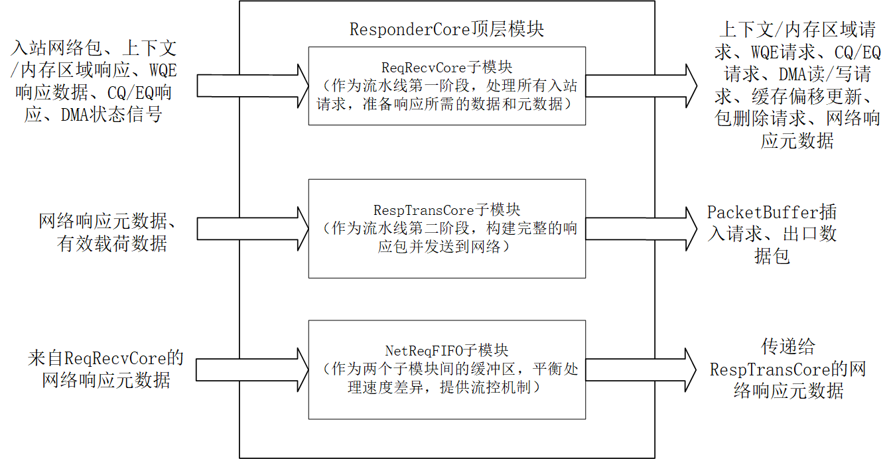

# ResponderCore

## 模块功能

ResponderCore是RDMA协议引擎的核心组件，负责处理接收到的网络请求并生成响应数据包。该模块实现了两个关键数据路径：RX\_REQ（请求接收）路径处理入站网络包和相关操作；TX\_RESP（响应发送）路径生成并发送响应包。模块采用模块化设计，集成了三个关键子模块，形成完整的响应处理流水线。

* **ReqRecvCore**：处理接收到的网络请求
  * 解析入站网络数据包
  * 通过OoOStation获取QP上下文和内存区域信息
  * 与接收队列管理器交互获取WQE
  * 管理DMA写操作以存储接收数据
  * 生成网络响应元数据
  * 触发完成队列和事件队列更新
* **RespTransCore**：生成并发送响应数据包
  * 读取网络响应元数据
  * 从GatherData获取有效载荷数据
  * 将响应数据插入PacketBuffer
  * 生成出口数据包元数据
  * 与传输子系统交互发送响应包
* **NetReqFIFO**：连接两个子模块
  * 缓冲网络响应元数据
  * 提供两个子模块间的流控
  * 确保数据完整传递

## 模块架构

<figure><figcaption></figcaption></figure>

## 模块接口

<table><thead><tr><th width="247">信号名</th><th width="95">输入/输出</th><th width="87">位宽</th><th width="151">对接模块</th><th width="247">中文说明</th></tr></thead><tbody><tr><td>clk</td><td>input</td><td>1</td><td>全局时钟</td><td>时钟信号</td></tr><tr><td>rst</td><td>input</td><td>1</td><td>全局复位</td><td>复位信号</td></tr><tr><td>RX_REQ_ingress_pkt_valid</td><td>input</td><td>1</td><td>PacketDeparser</td><td>RX_REQ入口包有效信号</td></tr><tr><td>RX_REQ_ingress_pkt_head</td><td>input</td><td>488</td><td>PacketDeparser</td><td>RX_REQ入口包头(元数据)</td></tr><tr><td>RX_REQ_ingress_pkt_ready</td><td>output</td><td>1</td><td>PacketDeparser</td><td>RX_REQ入口包就绪反压</td></tr><tr><td>RX_REQ_fetch_cxt_ingress_valid</td><td>output</td><td>1</td><td>OoOStation(CxtMgt)</td><td>RX_REQ上下文请求有效</td></tr><tr><td>RX_REQ_fetch_cxt_ingress_head</td><td>output</td><td>160</td><td>OoOStation(CxtMgt)</td><td>RX_REQ上下文请求头</td></tr><tr><td>RX_REQ_fetch_cxt_ingress_data</td><td>output</td><td>488</td><td>OoOStation(CxtMgt)</td><td>RX_REQ上下文请求数据</td></tr><tr><td>RX_REQ_fetch_cxt_ingress_start</td><td>output</td><td>1</td><td>OoOStation(CxtMgt)</td><td>RX_REQ上下文请求开始标志</td></tr><tr><td>RX_REQ_fetch_cxt_ingress_last</td><td>output</td><td>1</td><td>OoOStation(CxtMgt)</td><td>RX_REQ上下文请求结束标志</td></tr><tr><td>RX_REQ_fetch_cxt_ingress_ready</td><td>input</td><td>1</td><td>OoOStation(CxtMgt)</td><td>RX_REQ上下文请求就绪反压</td></tr><tr><td>RX_REQ_fetch_cxt_egress_valid</td><td>input</td><td>1</td><td>OoOStation(CxtMgt)</td><td>RX_REQ上下文响应有效</td></tr><tr><td>RX_REQ_fetch_cxt_egress_head</td><td>input</td><td>160</td><td>OoOStation(CxtMgt)</td><td>RX_REQ上下文响应头</td></tr><tr><td>RX_REQ_fetch_cxt_egress_data</td><td>input</td><td>640</td><td>OoOStation(CxtMgt)</td><td>RX_REQ上下文响应数据</td></tr><tr><td>RX_REQ_fetch_cxt_egress_start</td><td>input</td><td>1</td><td>OoOStation(CxtMgt)</td><td>RX_REQ上下文响应开始标志</td></tr><tr><td>RX_REQ_fetch_cxt_egress_last</td><td>input</td><td>1</td><td>OoOStation(CxtMgt)</td><td>RX_REQ上下文响应结束标志</td></tr><tr><td>RX_REQ_fetch_cxt_egress_ready</td><td>output</td><td>1</td><td>OoOStation(CxtMgt)</td><td>RX_REQ上下文响应就绪反压</td></tr><tr><td>RX_REQ_fetch_mr_ingress_valid</td><td>output</td><td>1</td><td>OoOStation(MRMgt)</td><td>RX_REQ内存区域请求有效</td></tr><tr><td>RX_REQ_fetch_mr_ingress_head</td><td>output</td><td>160</td><td>OoOStation(MRMgt)</td><td>RX_REQ内存区域请求头</td></tr><tr><td>RX_REQ_fetch_mr_ingress_data</td><td>output</td><td>352</td><td>OoOStation(MRMgt)</td><td>RX_REQ内存区域请求数据</td></tr><tr><td>RX_REQ_fetch_mr_ingress_start</td><td>output</td><td>1</td><td>OoOStation(MRMgt)</td><td>RX_REQ内存区域请求开始标志</td></tr><tr><td>RX_REQ_fetch_mr_ingress_last</td><td>output</td><td>1</td><td>OoOStation(MRMgt)</td><td>RX_REQ内存区域请求结束标志</td></tr><tr><td>RX_REQ_fetch_mr_ingress_ready</td><td>input</td><td>1</td><td>OoOStation(MRMgt)</td><td>RX_REQ内存区域请求就绪反压</td></tr><tr><td>RX_REQ_fetch_mr_egress_valid</td><td>input</td><td>1</td><td>OoOStation(MRMgt)</td><td>RX_REQ内存区域响应有效</td></tr><tr><td>RX_REQ_fetch_mr_egress_head</td><td>input</td><td>160</td><td>OoOStation(MRMgt)</td><td>RX_REQ内存区域响应头</td></tr><tr><td>RX_REQ_fetch_mr_egress_data</td><td>input</td><td>288</td><td>OoOStation(MRMgt)</td><td>RX_REQ内存区域响应数据</td></tr><tr><td>RX_REQ_fetch_mr_egress_start</td><td>input</td><td>1</td><td>OoOStation(MRMgt)</td><td>RX_REQ内存区域响应开始标志</td></tr><tr><td>RX_REQ_fetch_mr_egress_last</td><td>input</td><td>1</td><td>OoOStation(MRMgt)</td><td>RX_REQ内存区域响应结束标志</td></tr><tr><td>RX_REQ_fetch_mr_egress_ready</td><td>output</td><td>1</td><td>OoOStation(MRMgt)</td><td>RX_REQ内存区域响应就绪反压</td></tr><tr><td>RQ_wqe_req_valid</td><td>output</td><td>1</td><td>RecvQueueMgt</td><td>RQ WQE请求有效</td></tr><tr><td>RQ_wqe_req_head</td><td>output</td><td>576</td><td>RecvQueueMgt</td><td>RQ WQE请求头(元数据)</td></tr><tr><td>RQ_wqe_req_start</td><td>output</td><td>1</td><td>RecvQueueMgt</td><td>RQ WQE请求开始标志</td></tr><tr><td>RQ_wqe_req_last</td><td>output</td><td>1</td><td>RecvQueueMgt</td><td>RQ WQE请求结束标志</td></tr><tr><td>RQ_wqe_req_ready</td><td>input</td><td>1</td><td>RecvQueueMgt</td><td>RQ WQE请求就绪反压</td></tr><tr><td>RQ_wqe_resp_valid</td><td>input</td><td>1</td><td>RecvQueueMgt</td><td>RQ WQE响应有效</td></tr><tr><td>RQ_wqe_resp_head</td><td>input</td><td>576</td><td>RecvQueueMgt</td><td>RQ WQE响应头(元数据)</td></tr><tr><td>RQ_wqe_resp_data</td><td>input</td><td>128</td><td>RecvQueueMgt</td><td>RQ WQE响应数据(WQE段)</td></tr><tr><td>RQ_wqe_resp_start</td><td>input</td><td>1</td><td>RecvQueueMgt</td><td>RQ WQE响应开始标志</td></tr><tr><td>RQ_wqe_resp_last</td><td>input</td><td>1</td><td>RecvQueueMgt</td><td>RQ WQE响应结束标志</td></tr><tr><td>RQ_wqe_resp_ready</td><td>output</td><td>1</td><td>RecvQueueMgt</td><td>RQ WQE响应就绪反压</td></tr><tr><td>RQ_cache_offset_wen</td><td>output</td><td>1</td><td>CacheOffsetTable</td><td>RQ缓存偏移写使能</td></tr><tr><td>RQ_cache_offset_addr</td><td>output</td><td>8</td><td>CacheOffsetTable</td><td>RQ缓存偏移地址(QP索引)</td></tr><tr><td>RQ_cache_offset_din</td><td>output</td><td>8</td><td>CacheOffsetTable</td><td>RQ缓存偏移写数据</td></tr><tr><td>RQ_cache_offset_dout</td><td>input</td><td>8</td><td>CacheOffsetTable</td><td>RQ缓存偏移读数据</td></tr><tr><td>RQ_offset_wen</td><td>output</td><td>1</td><td>RQHeadRecord</td><td>RQ偏移写使能</td></tr><tr><td>RQ_offset_addr</td><td>output</td><td>8</td><td>RQHeadRecord</td><td>RQ偏移地址(QP索引)</td></tr><tr><td>RQ_offset_din</td><td>output</td><td>24</td><td>RQHeadRecord</td><td>RQ偏移写数据</td></tr><tr><td>RQ_offset_dout</td><td>input</td><td>24</td><td>RQHeadRecord</td><td>RQ偏移读数据</td></tr><tr><td>RQ_cache_owned_wen</td><td>output</td><td>1</td><td>RQHeadRecord</td><td>RQ缓存所有权写使能</td></tr><tr><td>RQ_cache_owned_addr</td><td>output</td><td>7</td><td>RQHeadRecord</td><td>RQ缓存所有权地址(缓存单元索引)</td></tr><tr><td>RQ_cache_owned_din</td><td>output</td><td>8</td><td>RQHeadRecord</td><td>RQ缓存所有权写数据(QP索引)</td></tr><tr><td>RQ_cache_owned_dout</td><td>input</td><td>8</td><td>RQHeadRecord</td><td>RQ缓存所有权读数据(QP索引)</td></tr><tr><td>RX_REQ_cq_req_valid</td><td>output</td><td>1</td><td>CompletionQueueMgt</td><td>RX_REQ CQ请求有效</td></tr><tr><td>RX_REQ_cq_req_head</td><td>output</td><td>64</td><td>CompletionQueueMgt</td><td>RX_REQ CQ请求头</td></tr><tr><td>RX_REQ_cq_req_ready</td><td>input</td><td>1</td><td>CompletionQueueMgt</td><td>RX_REQ CQ请求就绪反压</td></tr><tr><td>RX_REQ_cq_resp_valid</td><td>input</td><td>1</td><td>CompletionQueueMgt</td><td>RX_REQ CQ响应有效</td></tr><tr><td>RX_REQ_cq_resp_head</td><td>input</td><td>96</td><td>CompletionQueueMgt</td><td>RX_REQ CQ响应头</td></tr><tr><td>RX_REQ_cq_resp_ready</td><td>output</td><td>1</td><td>CompletionQueueMgt</td><td>RX_REQ CQ响应就绪反压</td></tr><tr><td>RX_REQ_eq_req_valid</td><td>output</td><td>1</td><td>EventQueueMgt</td><td>RX_REQ EQ请求有效</td></tr><tr><td>RX_REQ_eq_req_head</td><td>output</td><td>64</td><td>EventQueueMgt</td><td>RX_REQ EQ请求头</td></tr><tr><td>RX_REQ_eq_req_ready</td><td>input</td><td>1</td><td>EventQueueMgt</td><td>RX_REQ EQ请求就绪反压</td></tr><tr><td>RX_REQ_eq_resp_valid</td><td>input</td><td>1</td><td>EventQueueMgt</td><td>RX_REQ EQ响应有效</td></tr><tr><td>RX_REQ_eq_resp_head</td><td>input</td><td>96</td><td>EventQueueMgt</td><td>RX_REQ EQ响应头</td></tr><tr><td>RX_REQ_eq_resp_ready</td><td>output</td><td>1</td><td>EventQueueMgt</td><td>RX_REQ EQ响应就绪反压</td></tr><tr><td>RX_REQ_delete_req_valid</td><td>output</td><td>1</td><td>PacketBuffer</td><td>RX_REQ删除包请求有效</td></tr><tr><td>RX_REQ_delete_req_head</td><td>output</td><td>28</td><td>PacketBuffer</td><td>RX_REQ删除包请求头(槽位索引)</td></tr><tr><td>RX_REQ_delete_req_ready</td><td>input</td><td>1</td><td>PacketBuffer</td><td>RX_REQ删除包请求就绪反压</td></tr><tr><td>RX_REQ_delete_resp_valid</td><td>input</td><td>1</td><td>PacketBuffer</td><td>RX_REQ删除包响应有效</td></tr><tr><td>RX_REQ_delete_resp_start</td><td>input</td><td>1</td><td>PacketBuffer</td><td>RX_REQ删除包响应开始标志</td></tr><tr><td>RX_REQ_delete_resp_last</td><td>input</td><td>1</td><td>PacketBuffer</td><td>RX_REQ删除包响应结束标志</td></tr><tr><td>RX_REQ_delete_resp_data</td><td>input</td><td>512</td><td>PacketBuffer</td><td>RX_REQ删除包响应数据</td></tr><tr><td>RX_REQ_delete_resp_ready</td><td>output</td><td>1</td><td>PacketBuffer</td><td>RX_REQ删除包响应就绪反压</td></tr><tr><td>RX_REQ_scatter_req_wr_en</td><td>output</td><td>1</td><td>DMA引擎</td><td>RX_REQ DMA写请求使能</td></tr><tr><td>RX_REQ_scatter_req_din</td><td>output</td><td>160</td><td>DMA引擎</td><td>RX_REQ DMA写请求数据(地址+长度)</td></tr><tr><td>RX_REQ_scatter_req_prog_full</td><td>input</td><td>1</td><td>DMA引擎</td><td>RX_REQ DMA写请求FIFO满</td></tr><tr><td>RX_REQ_scatter_data_wr_en</td><td>output</td><td>1</td><td>DMA引擎</td><td>RX_REQ DMA写数据使能</td></tr><tr><td>RX_REQ_scatter_data_din</td><td>output</td><td>512</td><td>DMA引擎</td><td>RX_REQ DMA写数据</td></tr><tr><td>RX_REQ_scatter_data_prog_full</td><td>input</td><td>1</td><td>DMA引擎</td><td>RX_REQ DMA写数据FIFO满</td></tr><tr><td>TX_RESP_gather_req_wr_en</td><td>output</td><td>1</td><td>DMA引擎</td><td>TX_RESP DMA读请求使能</td></tr><tr><td>TX_RESP_gather_req_din</td><td>output</td><td>160</td><td>DMA引擎</td><td>TX_RESP DMA读请求数据(地址+长度)</td></tr><tr><td>TX_RESP_gather_req_prog_full</td><td>input</td><td>1</td><td>DMA引擎</td><td>TX_RESP DMA读请求FIFO满</td></tr><tr><td>TX_RESP_payload_empty</td><td>input</td><td>1</td><td>GatherData</td><td>TX_RESP有效载荷空标志</td></tr><tr><td>TX_RESP_payload_data</td><td>input</td><td>512</td><td>GatherData</td><td>TX_RESP有效载荷数据</td></tr><tr><td>TX_RESP_payload_rd_en</td><td>output</td><td>1</td><td>GatherData</td><td>TX_RESP有效载荷读使能</td></tr><tr><td>TX_RESP_insert_req_valid</td><td>output</td><td>1</td><td>PacketBuffer</td><td>TX_RESP插入包有效</td></tr><tr><td>TX_RESP_insert_req_start</td><td>output</td><td>1</td><td>PacketBuffer</td><td>TX_RESP插入包开始标志</td></tr><tr><td>TX_RESP_insert_req_last</td><td>output</td><td>1</td><td>PacketBuffer</td><td>TX_RESP插入包结束标志</td></tr><tr><td>TX_RESP_insert_req_head</td><td>output</td><td>9</td><td>PacketBuffer</td><td>TX_RESP插入包头(槽位索引)</td></tr><tr><td>TX_RESP_insert_req_data</td><td>output</td><td>512</td><td>PacketBuffer</td><td>TX_RESP插入包数据</td></tr><tr><td>TX_RESP_insert_req_ready</td><td>input</td><td>1</td><td>PacketBuffer</td><td>TX_RESP插入包就绪反压</td></tr><tr><td>TX_RESP_insert_resp_valid</td><td>input</td><td>1</td><td>PacketBuffer</td><td>TX_RESP插入包响应有效</td></tr><tr><td>TX_RESP_insert_resp_data</td><td>input</td><td>9</td><td>PacketBuffer</td><td>TX_RESP插入包响应数据(槽位索引)</td></tr><tr><td>TX_RESP_egress_pkt_valid</td><td>output</td><td>1</td><td>TransportSubsystem</td><td>TX_RESP出口包有效</td></tr><tr><td>TX_RESP_egress_pkt_head</td><td>output</td><td>488</td><td>TransportSubsystem</td><td>TX_RESP出口包头(元数据)</td></tr><tr><td>TX_RESP_egress_pkt_ready</td><td>input</td><td>1</td><td>TransportSubsystem</td><td>TX_RESP出口包就绪反压</td></tr></tbody></table>
