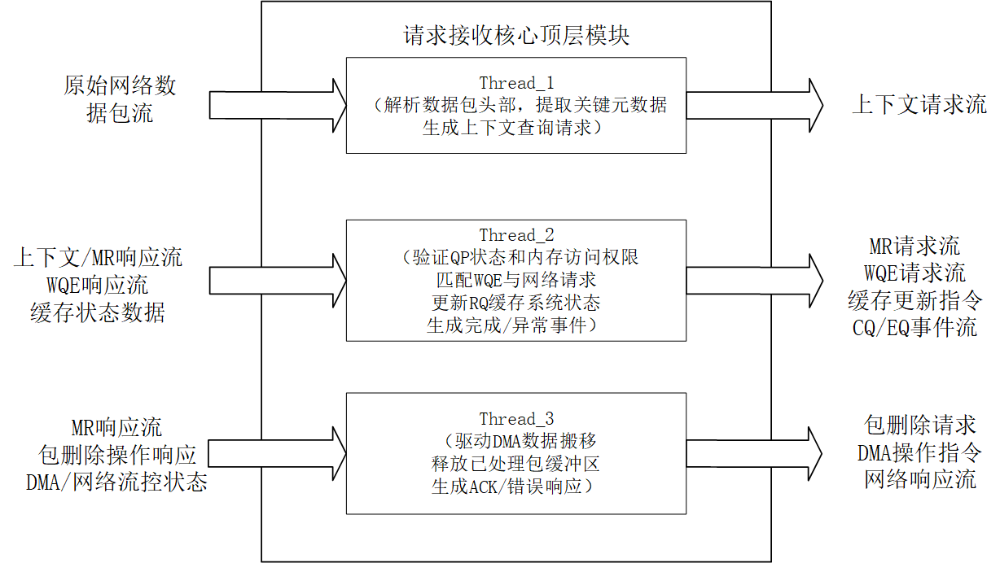

# ReqRecvCore

## 模块功能

#### **ReqRecvCore 模块功能**

ReqRecvCore 是一个高层控制模块，用于处理来自网络的请求 Request 数据包。其主要功能包括：\
接收来自 WQEParser 的原始请求包；\
协调三个子任务线程：

* Thread\_1：解析请求包，向 OoOStation 请求上下文（CXT）信息；
* Thread\_2：处理 CXT/MR 响应、与 RecvQueueMgt 交互获取工作队列条目（WQE），更新缓存状态，并生成完成队列（CQ）或事件队列（EQ）条目；
* Thread\_3：处理 MR 响应，驱动 Scatter-Gather 数据搬移，请求删除包缓冲区中已处理的包，并生成网络响应；

## 模块架构

<figure><figcaption></figcaption></figure>

## 模块接口

<table><thead><tr><th width="191">信号名</th><th width="95">输入/输出</th><th width="87">位宽</th><th width="151">对接模块</th><th width="247">中文说明</th></tr></thead><tbody><tr><td>clk</td><td>input</td><td>1</td><td>无（全局时钟）</td><td>时钟信号</td></tr><tr><td>rst</td><td>input</td><td>1</td><td>无（全局复位）</td><td>复位信号（高有效）</td></tr><tr><td>ingress_pkt_valid</td><td>input</td><td>1</td><td>TransportSubsystem</td><td>入口数据包有效标志</td></tr><tr><td>ingress_pkt_head</td><td>input</td><td>488</td><td>TransportSubsystem</td><td>入口数据包元数据头部</td></tr><tr><td>ingress_pkt_ready</td><td>output</td><td>1</td><td>TransportSubsystem</td><td>入口数据包接收就绪信号</td></tr><tr><td>fetch_cxt_ingress_valid</td><td>output</td><td>1</td><td>OoOStation(CxtMgt)</td><td>上下文管理请求有效信号</td></tr><tr><td>fetch_cxt_ingress_head</td><td>output</td><td>160</td><td>OoOStation(CxtMgt)</td><td>上下文管理请求头部</td></tr><tr><td>fetch_cxt_ingress_data</td><td>output</td><td>488</td><td>OoOStation(CxtMgt)</td><td>上下文管理请求数据</td></tr><tr><td>fetch_cxt_ingress_start</td><td>output</td><td>1</td><td>OoOStation(CxtMgt)</td><td>上下文管理请求起始标志</td></tr><tr><td>fetch_cxt_ingress_last</td><td>output</td><td>1</td><td>OoOStation(CxtMgt)</td><td>上下文管理请求结束标志</td></tr><tr><td>fetch_cxt_ingress_ready</td><td>input</td><td>1</td><td>OoOStation(CxtMgt)</td><td>上下文管理请求接收就绪信号</td></tr><tr><td>fetch_cxt_egress_valid</td><td>input</td><td>1</td><td>OoOStation(CxtMgt)</td><td>上下文管理响应有效标志</td></tr><tr><td>fetch_cxt_egress_head</td><td>input</td><td>672</td><td>OoOStation(CxtMgt)</td><td>上下文管理响应头部</td></tr><tr><td>fetch_cxt_egress_data</td><td>input</td><td>488</td><td>OoOStation(CxtMgt)</td><td>上下文管理响应数据</td></tr><tr><td>fetch_cxt_egress_start</td><td>input</td><td>1</td><td>OoOStation(CxtMgt)</td><td>上下文管理响应起始标志</td></tr><tr><td>fetch_cxt_egress_last</td><td>input</td><td>1</td><td>OoOStation(CxtMgt)</td><td>上下文管理响应结束标志</td></tr><tr><td>fetch_cxt_egress_ready</td><td>output</td><td>1</td><td>OoOStation(CxtMgt)</td><td>上下文管理响应接收就绪信号</td></tr><tr><td>fetch_mr_ingress_valid</td><td>output</td><td>1</td><td>OoOStation(MRMgt)</td><td>内存区域管理请求有效信号</td></tr><tr><td>fetch_mr_ingress_head</td><td>output</td><td>224</td><td>OoOStation(MRMgt)</td><td>内存区域管理请求头部</td></tr><tr><td>fetch_mr_ingress_data</td><td>output</td><td>512</td><td>OoOStation(MRMgt)</td><td>内存区域管理请求数据</td></tr><tr><td>fetch_mr_ingress_start</td><td>output</td><td>1</td><td>OoOStation(MRMgt)</td><td>内存区域管理请求起始标志</td></tr><tr><td>fetch_mr_ingress_last</td><td>output</td><td>1</td><td>OoOStation(MRMgt)</td><td>内存区域管理请求结束标志</td></tr><tr><td>fetch_mr_ingress_ready</td><td>input</td><td>1</td><td>OoOStation(MRMgt)</td><td>内存区域管理请求接收就绪信号</td></tr><tr><td>fetch_mr_egress_valid</td><td>input</td><td>1</td><td>OoOStation(MRMgt)</td><td>内存区域管理响应有效标志</td></tr><tr><td>fetch_mr_egress_head</td><td>input</td><td>256</td><td>OoOStation(MRMgt)</td><td>内存区域管理响应头部</td></tr><tr><td>fetch_mr_egress_data</td><td>input</td><td>512</td><td>OoOStation(MRMgt)</td><td>内存区域管理响应数据</td></tr><tr><td>fetch_mr_egress_start</td><td>input</td><td>1</td><td>OoOStation(MRMgt)</td><td>内存区域管理响应起始标志</td></tr><tr><td>fetch_mr_egress_last</td><td>input</td><td>1</td><td>OoOStation(MRMgt)</td><td>内存区域管理响应结束标志</td></tr><tr><td>fetch_mr_egress_ready</td><td>output</td><td>1</td><td>OoOStation(MRMgt)</td><td>内存区域管理响应接收就绪信号</td></tr><tr><td>wqe_req_valid</td><td>output</td><td>1</td><td>RecvQueueMgt</td><td>WQE请求有效信号</td></tr><tr><td>wqe_req_head</td><td>output</td><td>576</td><td>RecvQueueMgt</td><td>WQE请求元数据</td></tr><tr><td>wqe_req_start</td><td>output</td><td>1</td><td>RecvQueueMgt</td><td>WQE请求起始段标志</td></tr><tr><td>wqe_req_last</td><td>output</td><td>1</td><td>RecvQueueMgt</td><td>WQE请求结束段标志</td></tr><tr><td>wqe_req_ready</td><td>input</td><td>1</td><td>RecvQueueMgt</td><td>WQE请求接收就绪信号</td></tr><tr><td>wqe_resp_valid</td><td>input</td><td>1</td><td>RecvQueueMgt</td><td>WQE响应有效标志</td></tr><tr><td>wqe_resp_head</td><td>input</td><td>576</td><td>RecvQueueMgt</td><td>WQE响应元数据</td></tr><tr><td>wqe_resp_data</td><td>input</td><td>128</td><td>RecvQueueMgt</td><td>WQE响应数据段内容</td></tr><tr><td>wqe_resp_start</td><td>input</td><td>1</td><td>RecvQueueMgt</td><td>WQE响应起始段标志</td></tr><tr><td>wqe_resp_last</td><td>input</td><td>1</td><td>RecvQueueMgt</td><td>WQE响应结束段标志</td></tr><tr><td>wqe_resp_ready</td><td>output</td><td>1</td><td>RecvQueueMgt</td><td>WQE响应接收就绪信号</td></tr><tr><td>cache_offset_wen</td><td>output</td><td>1</td><td>CacheOffsetTable</td><td>缓存偏移表写使能信号</td></tr><tr><td>cache_offset_addr</td><td>output</td><td>8</td><td>CacheOffsetTable</td><td>缓存偏移表写地址（QP索引）</td></tr><tr><td>cache_offset_din</td><td>output</td><td>8</td><td>CacheOffsetTable</td><td>缓存偏移表写数据（RQ缓存槽号）</td></tr><tr><td>cache_offset_dout</td><td>input</td><td>8</td><td>CacheOffsetTable</td><td>缓存偏移表读数据</td></tr><tr><td>rq_offset_wen</td><td>output</td><td>1</td><td>RQHeadRecord</td><td>RQ头记录写使能信号</td></tr><tr><td>rq_offset_addr</td><td>output</td><td>8</td><td>RQHeadRecord</td><td>RQ头记录写地址（QP索引）</td></tr><tr><td>rq_offset_din</td><td>output</td><td>24</td><td>RQHeadRecord</td><td>RQ头记录写数据（偏移量）</td></tr><tr><td>rq_offset_dout</td><td>input</td><td>24</td><td>RQHeadRecord</td><td>RQ头记录读数据</td></tr><tr><td>RQ_cache_owned_wen</td><td>output</td><td>1</td><td>RQHeadRecord</td><td>RQ缓存占用表写使能信号</td></tr><tr><td>RQ_cache_owned_addr</td><td>output</td><td>7</td><td>RQHeadRecord</td><td>RQ缓存占用表写地址（缓存单元号）</td></tr><tr><td>RQ_cache_owned_din</td><td>output</td><td>8</td><td>RQHeadRecord</td><td>RQ缓存占用表写数据（QP索引）</td></tr><tr><td>RQ_cache_owned_dout</td><td>input</td><td>8</td><td>RQHeadRecord</td><td>RQ缓存占用表读数据</td></tr><tr><td>cq_req_valid</td><td>output</td><td>1</td><td>CompletionQueueMgt</td><td>CQ请求有效信号</td></tr><tr><td>cq_req_head</td><td>output</td><td>64</td><td>CompletionQueueMgt</td><td>CQ请求头部</td></tr><tr><td>cq_req_ready</td><td>input</td><td>1</td><td>CompletionQueueMgt</td><td>CQ请求接收就绪信号</td></tr><tr><td>cq_resp_valid</td><td>input</td><td>1</td><td>CompletionQueueMgt</td><td>CQ响应有效标志</td></tr><tr><td>cq_resp_head</td><td>input</td><td>96</td><td>CompletionQueueMgt</td><td>CQ响应头部</td></tr><tr><td>cq_resp_ready</td><td>output</td><td>1</td><td>CompletionQueueMgt</td><td>CQ响应接收就绪信号</td></tr><tr><td>eq_req_valid</td><td>output</td><td>1</td><td>EventQueueMgt</td><td>EQ请求有效信号</td></tr><tr><td>eq_req_head</td><td>output</td><td>64</td><td>EventQueueMgt</td><td>EQ请求头部</td></tr><tr><td>eq_req_ready</td><td>input</td><td>1</td><td>EventQueueMgt</td><td>EQ请求接收就绪信号</td></tr><tr><td>eq_resp_valid</td><td>input</td><td>1</td><td>EventQueueMgt</td><td>EQ响应有效标志</td></tr><tr><td>eq_resp_head</td><td>input</td><td>96</td><td>EventQueueMgt</td><td>EQ响应头部</td></tr><tr><td>eq_resp_ready</td><td>output</td><td>1</td><td>EventQueueMgt</td><td>EQ响应接收就绪信号</td></tr><tr><td>delete_req_valid</td><td>output</td><td>1</td><td>PacketBuffer</td><td>数据包删除请求有效信号</td></tr><tr><td>delete_req_head</td><td>output</td><td>32</td><td>PacketBuffer</td><td>数据包删除请求头部（起始/结束地址）</td></tr><tr><td>delete_req_ready</td><td>input</td><td>1</td><td>PacketBuffer</td><td>数据包删除请求接收就绪信号</td></tr><tr><td>delete_resp_valid</td><td>input</td><td>1</td><td>PacketBuffer</td><td>数据包删除响应有效标志</td></tr><tr><td>delete_resp_start</td><td>input</td><td>1</td><td>PacketBuffer</td><td>数据包删除响应起始标志</td></tr><tr><td>delete_resp_last</td><td>input</td><td>1</td><td>PacketBuffer</td><td>数据包删除响应结束标志</td></tr><tr><td>delete_resp_data</td><td>input</td><td>512</td><td>PacketBuffer</td><td>数据包删除响应数据</td></tr><tr><td>delete_resp_ready</td><td>output</td><td>1</td><td>PacketBuffer</td><td>数据包删除响应接收就绪信号</td></tr><tr><td>scatter_req_wr_en</td><td>output</td><td>1</td><td>DMAEngine</td><td>分散写请求使能信号</td></tr><tr><td>scatter_req_din</td><td>output</td><td>128</td><td>DMAEngine</td><td>分散写请求数据（地址+长度）</td></tr><tr><td>scatter_req_prog_full</td><td>input</td><td>1</td><td>DMAEngine</td><td>分散写请求缓冲区满标志</td></tr><tr><td>scatter_data_wr_en</td><td>output</td><td>1</td><td>DMAEngine</td><td>分散写数据使能信号</td></tr><tr><td>scatter_data_din</td><td>output</td><td>512</td><td>DMAEngine</td><td>分散写数据内容</td></tr><tr><td>scatter_data_prog_full</td><td>input</td><td>1</td><td>DMAEngine</td><td>分散写数据缓冲区满标志</td></tr><tr><td>gather_req_wr_en</td><td>output</td><td>1</td><td>DMAEngine</td><td>聚集读请求使能信号</td></tr><tr><td>gather_req_din</td><td>output</td><td>128</td><td>DMAEngine</td><td>聚集读请求数据（地址+长度）</td></tr><tr><td>gather_req_prog_full</td><td>input</td><td>1</td><td>DMAEngine</td><td>聚集读请求缓冲区满标志</td></tr><tr><td>net_resp_wen</td><td>output</td><td>1</td><td>RespTransCore</td><td>网络响应写使能信号</td></tr><tr><td>net_resp_din</td><td>output</td><td>512</td><td>RespTransCore</td><td>网络响应数据</td></tr><tr><td>net_resp_prog_full</td><td>input</td><td>1</td><td>RespTransCore</td><td>网络响应缓冲区满标志</td></tr></tbody></table>
