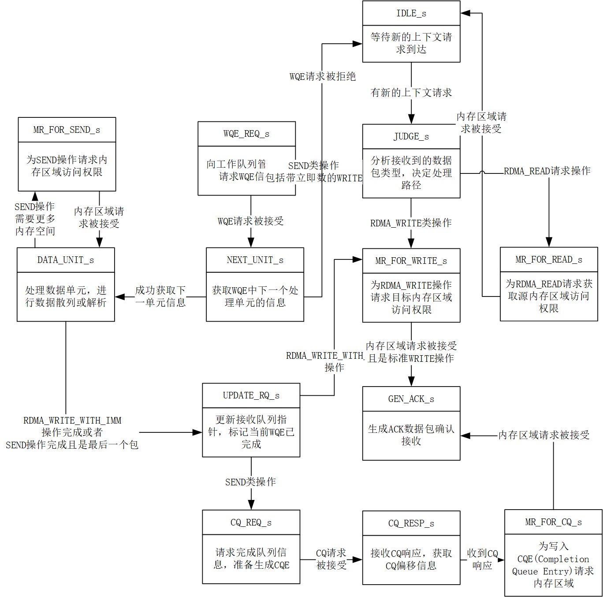

# ReqRecvCore\_Thread\_2

## 模块功能

ReqRecvCore\_Thread\_2 是 RDMA 接收路径中 ReqRecvCore 模块的第二阶段处理单元，其核心功能包括：\
接收来自 OoOStation 的 QP/CQ/EQ 上下文和原始包头；\
解析操作类型（SEND / RDMA\_WRITE / RDMA\_READ）和服务类型（RC/UC/UD）；\
根据操作类型决定是否发起内存区域（MR）地址翻译请求：

* Inline 操作或 RDMA Read：发送 BYPASS MR 请求；
* SEND / RDMA Write 等其他操作：需访问本地数据，发送数据 MR 请求； 对于 UC/UD 模式的完成操作，向 CompletionQueueMgt 发起 CQ 请求，获取 CQ 基地址，并发送 CQ MR 请求；\
  支持 Event 上报，向 EventQueueMgt 发起 EQ 请求及 EQ MR 请求；\
  管理接收 WQE 消费、RQ 指针更新、缓存槽偏移与所有权；\
  为 ReqRecvCore\_Thread\_3 生成包含操作元数据的 MR 请求数据。

## 模块接口

<table><thead><tr><th width="183">接口</th><th width="95">输入/输出</th><th width="87">位宽</th><th width="151">对接模块</th><th width="247">说明</th></tr></thead><tbody><tr><td>clk</td><td>input</td><td>1</td><td>全局时钟</td><td>系统主时钟</td></tr><tr><td>rst</td><td>input</td><td>1</td><td>全局复位</td><td>高有效异步复位</td></tr><tr><td>fetch_cxt_egress_valid</td><td>input</td><td>1</td><td>OoOStation</td><td>上下文响应有效信号</td></tr><tr><td>fetch_cxt_egress_head</td><td>input</td><td>416</td><td>OoOStation</td><td>QP/CQ/EQ 上下文</td></tr><tr><td>fetch_cxt_egress_data</td><td>input</td><td>488</td><td>OoOStation</td><td>原始包头元数据</td></tr><tr><td>fetch_cxt_egress_start</td><td>input</td><td>1</td><td>OoOStation</td><td>上下文响应事务起始</td></tr><tr><td>fetch_cxt_egress_last</td><td>input</td><td>1</td><td>OoOStation</td><td>上下文响应事务结束</td></tr><tr><td>fetch_cxt_egress_ready</td><td>output</td><td>1</td><td>OoOStation</td><td>本模块接收就绪信号</td></tr><tr><td>fetch_mr_ingress_valid</td><td>output</td><td>1</td><td>OoOStation</td><td>MR 请求有效信号</td></tr><tr><td>fetch_mr_ingress_head</td><td>output</td><td>224</td><td>OoOStation</td><td>MR 请求头（含地址、长度、key、PD、权限标志）</td></tr><tr><td>fetch_mr_ingress_data</td><td>output</td><td>256</td><td>OoOStation</td><td>操作元数据</td></tr><tr><td>fetch_mr_ingress_start</td><td>output</td><td>1</td><td>OoOStation</td><td>MR 请求事务起始</td></tr><tr><td>fetch_mr_ingress_last</td><td>output</td><td>1</td><td>OoOStation</td><td>MR 请求事务结束</td></tr><tr><td>fetch_mr_ingress_ready</td><td>input</td><td>1</td><td>OoOStation</td><td>OoOStation 接收就绪信号</td></tr><tr><td>wqe_req_valid</td><td>output</td><td>1</td><td>RecvQueueMgt</td><td>WQE 请求有效</td></tr><tr><td>wqe_req_head</td><td>output</td><td>576</td><td>RecvQueueMgt</td><td>WQE 请求头（含 QPN、PD、LKEY、RQ 长度）</td></tr><tr><td>wqe_req_start</td><td>output</td><td>1</td><td>RecvQueueMgt</td><td>WQE 请求起始</td></tr><tr><td>wqe_req_last</td><td>output</td><td>1</td><td>RecvQueueMgt</td><td>WQE 请求结束</td></tr><tr><td>wqe_req_ready</td><td>input</td><td>1</td><td>RecvQueueMgt</td><td>RecvQueueMgt 就绪信号</td></tr><tr><td>wqe_resp_valid</td><td>input</td><td>1</td><td>RecvQueueMgt</td><td>WQE 响应有效</td></tr><tr><td>wqe_resp_head</td><td>input</td><td>576</td><td>RecvQueueMgt</td><td>WQE 元数据</td></tr><tr><td>wqe_resp_data</td><td>input</td><td>128</td><td>RecvQueueMgt</td><td>WQE 数据段（NextUnit / DataUnit）</td></tr><tr><td>wqe_resp_start</td><td>input</td><td>1</td><td>RecvQueueMgt</td><td>WQE 响应起始</td></tr><tr><td>wqe_resp_last</td><td>input</td><td>1</td><td>RecvQueueMgt</td><td>WQE 响应结束</td></tr><tr><td>wqe_resp_ready</td><td>output</td><td>1</td><td>RecvQueueMgt</td><td>本模块消费就绪信号</td></tr><tr><td>cache_offset_wen</td><td>output</td><td>1</td><td>Cache Offset Table</td><td>缓存槽偏移表写使能</td></tr><tr><td>cache_offset_addr</td><td>output</td><td>8</td><td>Cache Offset Table</td><td>QP 索引（地址）</td></tr><tr><td>cache_offset_din</td><td>output</td><td>8</td><td>Cache Offset Table</td><td>新缓存槽号</td></tr><tr><td>cache_offset_dout</td><td>input</td><td>8</td><td>Cache Offset Table</td><td>当前缓存槽号</td></tr><tr><td>cache_owned_wen</td><td>output</td><td>1</td><td>CacheOwnedTable</td><td>缓存槽所有权表写使能</td></tr><tr><td>cache_owned_addr</td><td>output</td><td>7</td><td>CacheOwnedTable</td><td>缓存槽地址</td></tr><tr><td>cache_owned_din</td><td>output</td><td>8</td><td>CacheOwnedTable</td><td>拥有该槽的 QP 号</td></tr><tr><td>cache_owned_dout</td><td>input</td><td>8</td><td>CacheOwnedTable</td><td>当前占用者 QP 号</td></tr><tr><td>rq_offset_wen</td><td>output</td><td>1</td><td>RQHeadRecord</td><td>RQ 消费指针表写使能</td></tr><tr><td>rq_offset_addr</td><td>output</td><td>8</td><td>RQHeadRecord</td><td>QP 索引</td></tr><tr><td>rq_offset_din</td><td>output</td><td>24</td><td>RQHeadRecord</td><td>新消费指针</td></tr><tr><td>rq_offset_dout</td><td>input</td><td>24</td><td>RQHeadRecord</td><td>当前生产指针</td></tr><tr><td>cq_req_valid</td><td>output</td><td>1</td><td>CompletionQueueMgt</td><td>CQ 请求有效</td></tr><tr><td>cq_req_head</td><td>output</td><td>64</td><td>CompletionQueueMgt</td><td>CQ 请求头（含 CQN、长度）</td></tr><tr><td>cq_req_ready</td><td>input</td><td>1</td><td>CompletionQueueMgt</td><td>CQ Mgt 就绪信号</td></tr><tr><td>cq_resp_valid</td><td>input</td><td>1</td><td>CompletionQueueMgt</td><td>CQ 响应有效</td></tr><tr><td>cq_resp_head</td><td>input</td><td>96</td><td>CompletionQueueMgt</td><td>CQ 响应头（含基地址 LADDR）</td></tr><tr><td>cq_resp_ready</td><td>output</td><td>1</td><td>CompletionQueueMgt</td><td>本模块接收 CQ 响应就绪</td></tr><tr><td>eq_req_valid</td><td>output</td><td>1</td><td>EventQueueMgt</td><td>EQ 请求有效</td></tr><tr><td>eq_req_head</td><td>output</td><td>64</td><td>EventQueueMgt</td><td>EQ 请求头（含 EQN、长度）</td></tr><tr><td>eq_req_ready</td><td>input</td><td>1</td><td>EventQueueMgt</td><td>EQ Mgt 就绪信号</td></tr><tr><td>eq_resp_valid</td><td>input</td><td>1</td><td>EventQueueMgt</td><td>EQ 响应有效</td></tr><tr><td>eq_resp_head</td><td>input</td><td>96</td><td>EventQueueMgt</td><td>EQ 响应头（含基地址 LADDR）</td></tr><tr><td>eq_resp_ready</td><td>output</td><td>1</td><td>EventQueueMgt</td><td>本模块接收 EQ 响应就绪</td></tr></tbody></table>

## 状态机设计

### 状态定义

<table><thead><tr><th width="119">状态名</th><th width="111">编码（6'b）</th><th width="442">说明</th></tr></thead><tbody><tr><td>IDLE_s</td><td>6'b000001</td><td>空闲状态：等待上下文响应</td></tr><tr><td>JUDGE_s</td><td>6'b000010</td><td>判决状态：解析 opcode，决定处理路径</td></tr><tr><td>WQE_REQ_s</td><td>6'b000011</td><td>向RecvQueueMgt请求WQE</td></tr><tr><td>NEXT_UNIT_s</td><td>6'b000100</td><td>解析 WQE NextUnit</td></tr><tr><td>DATA_UNIT_s</td><td>6'b000101</td><td>解析 WQE DataUnit（多段 SEND）</td></tr><tr><td>CQ_REQ_s</td><td>6'b000110</td><td>请求 CQ 基地址</td></tr><tr><td>CQ_RESP_s</td><td>6'b000111</td><td>接收 CQ 基地址</td></tr><tr><td>EQ_REQ_s</td><td>6'b001000</td><td>请求 EQ 基地址</td></tr><tr><td>EQ_RESP_s</td><td>6'b001001</td><td>接收 EQ 基地址</td></tr><tr><td>UPDATE_RQ_s</td><td>6'b001010</td><td>更新 RQ 指针和缓存状态</td></tr><tr><td>MR_FOR_SEND_s</td><td>6'b001011</td><td>为 SEND 发起 MR 请求</td></tr><tr><td>MR_FOR_WRITE_s</td><td>6'b001100</td><td>为 RDMA_WRITE 发起 MR 请求</td></tr><tr><td>MR_FOR_READ_s</td><td>6'b001101</td><td>为 RDMA_READ 发起 MR 请求</td></tr><tr><td>MR_FOR_CQ_s</td><td>6'b001110</td><td>为 CQ 发起 MR 请求</td></tr><tr><td>MR_FOR_EQ_s</td><td>6'b001111</td><td>为 EQ 发起 MR 请求</td></tr><tr><td>GEN_ACK_s</td><td>6'b010000</td><td>生成 ACK响应，UC/RC 完成确认</td></tr></tbody></table>

### 状态转移表

<table><thead><tr><th width="119">现态</th><th width="119">次态</th><th width="526.4284057617188">转移条件</th><th width="247">中文说明</th></tr></thead><tbody><tr><td>IDLE_s</td><td>JUDGE_s</td><td>fetch_cxt_egress_valid == 1</td><td>收到上下文响应，进入操作码判决状态</td></tr><tr><td>IDLE_s</td><td>IDLE_s</td><td>fetch_cxt_egress_valid == 0</td><td>无上下文响应，保持空闲</td></tr><tr><td>JUDGE_s</td><td>WQE_REQ_s</td><td>PktHeader_net_opcode == `SEND_FIRST || PktHeader_net_opcode == `SEND_MIDDLE || PktHeader_net_opcode == `SEND_LAST || PktHeader_net_opcode == `SEND_ONLY || PktHeader_net_opcode == `SEND_LAST_WITH_IMM || PktHeader_net_opcode == `SEND_ONLY_WITH_IMM || PktHeader_net_opcode == `RDMA_WRITE_LAST_WITH_IMM || PktHeader_net_opcode == `RDMA_WRITE_ONLY_WITH_IMM</td><td>操作需消费接收 WQE（SEND 类或 RDMA_WRITE_WITH_IMM）</td></tr><tr><td>JUDGE_s</td><td>MR_FOR_WRITE_s</td><td>PktHeader_net_opcode == `RDMA_WRITE_FIRST || PktHeader_net_opcode == `RDMA_WRITE_MIDDLE || PktHeader_net_opcode == `RDMA_WRITE_LAST || PktHeader_net_opcode == `RDMA_WRITE_ONLY</td><td>RDMA_WRITE 操作，直接发起 MR 权限验证</td></tr><tr><td>JUDGE_s</td><td>MR_FOR_READ_s</td><td>PktHeader_net_opcode == `RDMA_READ_REQUEST_FIRST || PktHeader_net_opcode == `RDMA_READ_REQUEST_MIDDLE || PktHeader_net_opcode == `RDMA_READ_REQUEST_LAST || PktHeader_net_opcode == `RDMA_READ_REQUEST_ONLY</td><td>RDMA_READ 请求，发起 MR 权限验证</td></tr><tr><td>JUDGE_s</td><td>IDLE_s</td><td>PktHeader_net_opcode != `SEND_FIRST &#x26;&#x26; PktHeader_net_opcode != `SEND_MIDDLE &#x26;&#x26; PktHeader_net_opcode != `SEND_LAST &#x26;&#x26; PktHeader_net_opcode != `SEND_ONLY &#x26;&#x26; PktHeader_net_opcode != `SEND_LAST_WITH_IMM &#x26;&#x26; PktHeader_net_opcode != `SEND_ONLY_WITH_IMM &#x26;&#x26; PktHeader_net_opcode != `RDMA_WRITE_LAST_WITH_IMM &#x26;&#x26; PktHeader_net_opcode != `RDMA_WRITE_ONLY_WITH_IMM &#x26;&#x26; PktHeader_net_opcode != `RDMA_WRITE_FIRST &#x26;&#x26; PktHeader_net_opcode != `RDMA_WRITE_MIDDLE &#x26;&#x26; PktHeader_net_opcode != `RDMA_WRITE_LAST &#x26;&#x26; PktHeader_net_opcode != `RDMA_WRITE_ONLY &#x26;&#x26; PktHeader_net_opcode != `RDMA_READ_REQUEST_FIRST &#x26;&#x26; PktHeader_net_opcode != `RDMA_READ_REQUEST_MIDDLE &#x26;&#x26; PktHeader_net_opcode != `RDMA_READ_REQUEST_LAST &#x26;&#x26; PktHeader_net_opcode != `RDMA_READ_REQUEST_ONLY</td><td>操作码不匹配任何已知类型，返回空闲</td></tr><tr><td>WQE_REQ_s</td><td>NEXT_UNIT_s</td><td>wqe_req_valid == 1 &#x26;&#x26; wqe_req_ready == 1</td><td>WQE 请求被 RecvQueueMgt 接受，进入解析状态</td></tr><tr><td>WQE_REQ_s</td><td>IDLE_s</td><td>wqe_req_valid == 0 || wqe_req_ready == 0</td><td>WQE 请求握手失败，返回空闲</td></tr><tr><td>NEXT_UNIT_s</td><td>DATA_UNIT_s</td><td>wqe_resp_valid == 1 &#x26;&#x26; wqe_resp_ready == 1</td><td>收到 WQE NextUnit 响应，进入 DataUnit 解析</td></tr><tr><td>NEXT_UNIT_s</td><td>NEXT_UNIT_s</td><td>wqe_resp_valid == 0 || wqe_resp_ready == 0</td><td>未收到有效 WQE 响应，继续等待</td></tr><tr><td>DATA_UNIT_s</td><td>UPDATE_RQ_s</td><td>PktHeader_net_opcode == `RDMA_WRITE_LAST_WITH_IMM &#x26;&#x26; wqe_resp_valid == 1 &#x26;&#x26; wqe_resp_last == 1 &#x26;&#x26; wqe_resp_ready == 1</td><td>RDMA_WRITE_WITH_IMM 仅消费 WQE，无需解析 DataUnit，更新 RQ 指针</td></tr><tr><td>DATA_UNIT_s</td><td>UPDATE_RQ_s</td><td>PktHeader_net_opcode == `RDMA_WRITE_ONLY_WITH_IMM &#x26;&#x26; wqe_resp_valid == 1 &#x26;&#x26; wqe_resp_last == 1 &#x26;&#x26; wqe_resp_ready == 1</td><td>RDMA_WRITE_WITH_IMM 仅消费 WQE，无需解析 DataUnit，更新 RQ 指针</td></tr><tr><td>DATA_UNIT_s</td><td>UPDATE_RQ_s</td><td>PktHeader_net_opcode == `SEND_LAST &#x26;&#x26; pkt_length_left == 0 &#x26;&#x26; wqe_resp_last == 1</td><td>SEND 最终段完成，且包 payload 已全部接收，更新 RQ</td></tr><tr><td>DATA_UNIT_s</td><td>UPDATE_RQ_s</td><td>PktHeader_net_opcode == `SEND_ONLY &#x26;&#x26; pkt_length_left == 0 &#x26;&#x26; wqe_resp_last == 1</td><td>SEND 最终段完成，且包 payload 已全部接收，更新 RQ</td></tr><tr><td>DATA_UNIT_s</td><td>UPDATE_RQ_s</td><td>PktHeader_net_opcode == `SEND_LAST_WITH_IMM &#x26;&#x26; pkt_length_left == 0 &#x26;&#x26; wqe_resp_last == 1</td><td>SEND 最终段完成，且包 payload 已全部接收，更新 RQ</td></tr><tr><td>DATA_UNIT_s</td><td>UPDATE_RQ_s</td><td>PktHeader_net_opcode == `SEND_ONLY_WITH_IMM &#x26;&#x26; pkt_length_left == 0 &#x26;&#x26; wqe_resp_last == 1</td><td>SEND 最终段完成，且包 payload 已全部接收，更新 RQ</td></tr><tr><td>DATA_UNIT_s</td><td>GEN_ACK_s</td><td>PktHeader_net_opcode != `RDMA_WRITE_LAST_WITH_IMM &#x26;&#x26; PktHeader_net_opcode != `RDMA_WRITE_ONLY_WITH_IMM &#x26;&#x26; PktHeader_net_opcode != `SEND_LAST &#x26;&#x26; PktHeader_net_opcode != `SEND_ONLY &#x26;&#x26; PktHeader_net_opcode != `SEND_LAST_WITH_IMM &#x26;&#x26; PktHeader_net_opcode != `SEND_ONLY_WITH_IMM &#x26;&#x26; pkt_length_left == 0 &#x26;&#x26; wqe_resp_last == 1</td><td>多段 SEND 的中间段结束，生成 ACK</td></tr><tr><td>DATA_UNIT_s</td><td>MR_FOR_SEND_s</td><td>PktHeader_net_opcode != `RDMA_WRITE_LAST_WITH_IMM &#x26;&#x26; PktHeader_net_opcode != `RDMA_WRITE_ONLY_WITH_IMM &#x26;&#x26; pkt_length_left > 0 &#x26;&#x26; parsed_msg_length + DataUnit_byte_cnt > msg_offset_doutb</td><td>当前 DataUnit 超出已缓存消息范围，需发起 MR 请求以访问新内存页</td></tr><tr><td>DATA_UNIT_s</td><td>DATA_UNIT_s</td><td>wqe_resp_valid == 0</td><td>无 WQE 响应，继续等待</td></tr><tr><td>DATA_UNIT_s</td><td>DATA_UNIT_s</td><td>pkt_length_left == 0 &#x26;&#x26; wqe_resp_last == 0</td><td>payload 已接收完但未结束，继续等待</td></tr><tr><td>DATA_UNIT_s</td><td>DATA_UNIT_s</td><td>pkt_length_left > 0 &#x26;&#x26; parsed_msg_length + DataUnit_byte_cnt &#x3C;= msg_offset_doutb</td><td>当前 DataUnit 在已缓存范围内，继续解析</td></tr><tr><td>CQ_REQ_s</td><td>CQ_RESP_s</td><td>cq_req_valid == 1 &#x26;&#x26; cq_req_ready == 1</td><td>CQ 请求被 CompletionQueueMgt 接受，等待 CQ 基地址</td></tr><tr><td>CQ_REQ_s</td><td>CQ_REQ_s</td><td>cq_req_valid == 0 || cq_req_ready == 0</td><td>CQ 请求未就绪，继续等待</td></tr><tr><td>CQ_RESP_s</td><td>MR_FOR_CQ_s</td><td>cq_resp_valid == 1 &#x26;&#x26; cq_resp_ready == 1</td><td>收到 CQ 响应（含基地址），发起 CQ MR 权限验证</td></tr><tr><td>CQ_RESP_s</td><td>CQ_RESP_s</td><td>cq_resp_valid == 0 || cq_resp_ready == 0</td><td>未收到 CQ 响应，继续等待</td></tr><tr><td>EQ_REQ_s</td><td>EQ_RESP_s</td><td>eq_req_valid == 1 &#x26;&#x26; eq_req_ready == 1</td><td>EQ 请求被 EventQueueMgt 接受，等待 EQ 基地址</td></tr><tr><td>EQ_REQ_s</td><td>EQ_REQ_s</td><td>eq_req_valid == 0 || eq_req_ready == 0</td><td>EQ 请求未就绪，继续等待</td></tr><tr><td>EQ_RESP_s</td><td>MR_FOR_EQ_s</td><td>eq_resp_valid == 1 &#x26;&#x26; eq_resp_ready == 1</td><td>收到 EQ 响应（含基地址），发起 EQ MR 权限验证</td></tr><tr><td>EQ_RESP_s</td><td>EQ_RESP_s</td><td>eq_resp_valid == 0 || eq_resp_ready == 0</td><td>未收到 EQ 响应，继续等待</td></tr><tr><td>UPDATE_RQ_s</td><td>CQ_REQ_s</td><td>PktHeader_net_opcode == `SEND_LAST || PktHeader_net_opcode == `SEND_ONLY || PktHeader_net_opcode == `SEND_LAST_WITH_IMM || PktHeader_net_opcode == `SEND_ONLY_WITH_IMM</td><td>需提交成功 CQE，进入 CQ 请求状态</td></tr><tr><td>UPDATE_RQ_s</td><td>MR_FOR_WRITE_s</td><td>PktHeader_net_opcode == `RDMA_WRITE_LAST_WITH_IMM || PktHeader_net_opcode == `RDMA_WRITE_ONLY_WITH_IMM</td><td>继续处理 RDMA_WRITE_WITH_IMM 的 MR 验证</td></tr><tr><td>UPDATE_RQ_s</td><td>IDLE_s</td><td>PktHeader_net_opcode != `SEND_LAST &#x26;&#x26; PktHeader_net_opcode != `SEND_ONLY &#x26;&#x26; PktHeader_net_opcode != `SEND_LAST_WITH_IMM &#x26;&#x26; PktHeader_net_opcode != `SEND_ONLY_WITH_IMM &#x26;&#x26; PktHeader_net_opcode != `RDMA_WRITE_LAST_WITH_IMM &#x26;&#x26; PktHeader_net_opcode != `RDMA_WRITE_ONLY_WITH_IMM</td><td>无后续操作，返回空闲</td></tr><tr><td>MR_FOR_SEND_s</td><td>DATA_UNIT_s</td><td>fetch_mr_ingress_valid == 1 &#x26;&#x26; fetch_mr_ingress_ready == 1</td><td>MR 请求完成，返回 DataUnit 解析状态</td></tr><tr><td>MR_FOR_SEND_s</td><td>MR_FOR_SEND_s</td><td>fetch_mr_ingress_valid == 0 || fetch_mr_ingress_ready == 0</td><td>MR 请求未完成，继续等待</td></tr><tr><td>MR_FOR_WRITE_s</td><td>GEN_ACK_s</td><td>fetch_mr_ingress_valid == 1 &#x26;&#x26; fetch_mr_ingress_ready == 1 &#x26;&#x26; PktHeader_net_opcode == `RDMA_WRITE_FIRST || PktHeader_net_opcode == `RDMA_WRITE_MIDDLE || PktHeader_net_opcode == `RDMA_WRITE_LAST || PktHeader_net_opcode == `RDMA_WRITE_LAST_WITH_IMM || PktHeader_net_opcode == `RDMA_WRITE_ONLY || PktHeader_net_opcode == `RDMA_WRITE_ONLY_WITH_IMM</td><td>RDMA_WRITE MR 验证完成，生成 ACK</td></tr><tr><td>MR_FOR_WRITE_s</td><td>IDLE_s</td><td>fetch_mr_ingress_valid == 1 &#x26;&#x26; fetch_mr_ingress_ready == 1 &#x26;&#x26; PktHeader_net_opcode != `RDMA_WRITE_FIRST &#x26;&#x26; PktHeader_net_opcode != `RDMA_WRITE_MIDDLE &#x26;&#x26; PktHeader_net_opcode != `RDMA_WRITE_LAST &#x26;&#x26; PktHeader_net_opcode != `RDMA_WRITE_LAST_WITH_IMM &#x26;&#x26; PktHeader_net_opcode != `RDMA_WRITE_ONLY &#x26;&#x26; PktHeader_net_opcode != `RDMA_WRITE_ONLY_WITH_IMM</td><td>MR 完成但操作码不匹配，返回空闲（异常路径）</td></tr><tr><td>MR_FOR_WRITE_s</td><td>MR_FOR_WRITE_s</td><td>fetch_mr_ingress_valid == 0 || fetch_mr_ingress_ready == 0</td><td>MR 请求未完成，继续等待</td></tr><tr><td>MR_FOR_READ_s</td><td>IDLE_s</td><td>fetch_mr_ingress_valid == 1 &#x26;&#x26; fetch_mr_ingress_ready == 1</td><td>RDMA_READ MR 验证完成，后续由 Thread_3 处理</td></tr><tr><td>MR_FOR_READ_s</td><td>MR_FOR_READ_s</td><td>fetch_mr_ingress_valid == 0 || fetch_mr_ingress_ready == 0</td><td>等待 RDMA_READ MR 响应</td></tr><tr><td>MR_FOR_CQ_s</td><td>GEN_ACK_s</td><td>fetch_mr_ingress_valid == 1 &#x26;&#x26; fetch_mr_ingress_ready == 1</td><td>CQ MR 请求完成，生成 ACK</td></tr><tr><td>MR_FOR_CQ_s</td><td>MR_FOR_CQ_s</td><td>fetch_mr_ingress_valid == 0 || fetch_mr_ingress_ready == 0</td><td>等待 CQ MR 响应</td></tr><tr><td>MR_FOR_EQ_s</td><td>GEN_ACK_s</td><td>fetch_mr_ingress_valid == 1 &#x26;&#x26; fetch_mr_ingress_ready == 1</td><td>EQ MR 请求完成，生成 ACK</td></tr><tr><td>MR_FOR_EQ_s</td><td>MR_FOR_CQ_s</td><td>fetch_mr_ingress_valid == 0 || fetch_mr_ingress_ready == 0</td><td>等待 EQ MR 响应</td></tr><tr><td>GEN_ACK_s</td><td>IDLE_s</td><td>fetch_mr_ingress_valid == 1 &#x26;&#x26; fetch_mr_ingress_ready == 1</td><td>ACK 生成完成，返回空闲</td></tr><tr><td>GEN_ACK_s</td><td>GEN_ACK_s</td><td>fetch_mr_ingress_valid == 0 || fetch_mr_ingress_ready == 0</td><td>等待 MR 请求完成</td></tr><tr><td>default</td><td>IDLE_s</td><td>默认转移</td><td>进入未定义状态，安全回退到空闲</td></tr></tbody></table>

### 状态转移表

<figure><figcaption></figcaption></figure>
