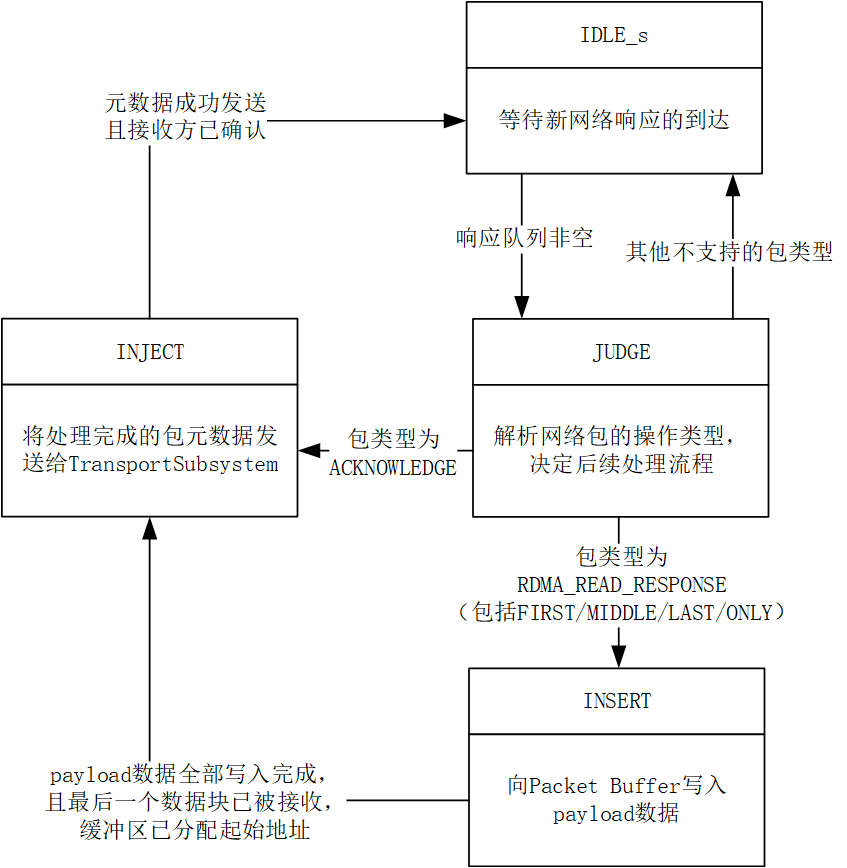

# RespTransCore\_Thread\_1

## 模块功能

RespTransCore\_Thread\_1 是 RDMA 网络协议引擎中的一个处理单元，主要功能是处理来自网络的响应包（Response Packet）。具体包括：

* 接收网络响应元数据（如 RDMA Read 响应或 ACK 包）；
* 根据操作码（opcode）判断包类型：
  * 若为 ACKNOWLEDGE，则无需 payload，直接构造元数据注入出口；
  * 若为 RDMA\_READ\_RESPONSE\_\*，则需从 Gather Data 模块读取 payload 数据；
* 将 payload 数据分块写入 Packet Buffer（每块 64 字节），并记录分配的缓冲区起始地址；
* 构造完整的包元数据（包括本地/远端 QPN、IP/MAC、buffer 地址、长度等），发送给 TransportSubsystem 以完成实际发包。

## 模块接口

<table><thead><tr><th width="143">信号名</th><th width="95">输入/输出</th><th width="247">位宽</th><th width="151">对接模块</th><th width="247">中文说明</th></tr></thead><tbody><tr><td>clk</td><td>input</td><td>1</td><td>无（全局时钟）</td><td>时钟信号</td></tr><tr><td>rst</td><td>input</td><td>1</td><td>无（全局复位）</td><td>复位信号（高有效）</td></tr><tr><td>net_resp_ren</td><td>output</td><td>1</td><td>ReqRecvCore</td><td>从ReqRecvCore读取响应数据的使能信号</td></tr><tr><td>net_resp_empty</td><td>input</td><td>1</td><td>ReqRecvCore</td><td>来自ReqRecvCore的响应队列空标志</td></tr><tr><td>net_resp_dout</td><td>input</td><td>512</td><td>ReqRecvCore</td><td>来自ReqRecvCore的响应元数据</td></tr><tr><td>payload_empty</td><td>input</td><td>1</td><td>Gather Data</td><td>有效载荷数据缓冲区空标志</td></tr><tr><td>payload_data</td><td>input</td><td>512</td><td>Gather Data</td><td>512位有效载荷数据</td></tr><tr><td>payload_ren</td><td>output</td><td>1</td><td>Gather Data</td><td>读取有效载荷数据的使能信号</td></tr><tr><td>insert_req_valid</td><td>output</td><td>1</td><td>Payload Buffer</td><td>向Payload Buffer插入数据的请求有效信号</td></tr><tr><td>insert_req_start</td><td>output</td><td>1</td><td>Payload Buffer</td><td>插入请求的起始段标志</td></tr><tr><td>insert_req_last</td><td>output</td><td>1</td><td>Payload Buffer</td><td>插入请求的结束段标志</td></tr><tr><td>insert_req_head</td><td>output</td><td>9</td><td>Payload Buffer</td><td>插入请求的头部信息（总段数）</td></tr><tr><td>insert_req_data</td><td>output</td><td>512</td><td>Payload Buffer</td><td>插入请求的512位数据段内容</td></tr><tr><td>insert_req_ready</td><td>input</td><td>1</td><td>Payload Buffer</td><td>Payload Buffer接收插入请求的就绪信号</td></tr><tr><td>insert_resp_valid</td><td>input</td><td>1</td><td>Payload Buffer</td><td>Payload Buffer插入响应的有效标志</td></tr><tr><td>insert_resp_data</td><td>input</td><td>9</td><td>Payload Buffer</td><td>Payload Buffer返回的插入起始地址</td></tr><tr><td>egress_pkt_valid</td><td>output</td><td>1</td><td>TransportSubsystem</td><td>输出数据包有效标志</td></tr><tr><td>egress_pkt_head</td><td>output</td><td>488</td><td>TransportSubsystem</td><td>输出数据包的元数据头部</td></tr><tr><td>egress_pkt_ready</td><td>input</td><td>1</td><td>TransportSubsystem</td><td>TransportSubsystem接收数据包的就绪信号</td></tr></tbody></table>

## 状态机设计

### 状态定义

<table><thead><tr><th width="87">状态名</th><th width="111">编码（3'd）</th><th width="167">中文含义</th></tr></thead><tbody><tr><td>IDLE_s</td><td>1</td><td>空闲状态</td></tr><tr><td>JUDGE_s</td><td>2</td><td>包类型判断状态</td></tr><tr><td>INSERT_s</td><td>3</td><td>payload 插入状态</td></tr><tr><td>INJECT_s</td><td>4</td><td>包元数据注入状态</td></tr></tbody></table>

### 状态转移表

<table><thead><tr><th width="87">现态</th><th width="87">次态</th><th width="463.5714111328125">转移条件</th><th width="247">中文说明</th></tr></thead><tbody><tr><td>IDLE_s</td><td>JUDGE_s</td><td>!net_resp_empty</td><td>有新网络响应到达，进入判断</td></tr><tr><td>IDLE_s</td><td>IDLE_s</td><td>net_resp_empty</td><td>无响应，保持空闲</td></tr><tr><td>JUDGE_s</td><td>INJECT_s</td><td>(net_opcode == `ACKNOWLEDGE)</td><td>是 ACK 包，无需 payload，直接注入</td></tr><tr><td>JUDGE_s</td><td>INSERT_s</td><td>(net_opcode == `RDMA_READ_RESPONSE_FIRST) || (net_opcode == `RDMA_READ_RESPONSE_MIDDLE) || (net_opcode == `RDMA_READ_RESPONSE_LAST) || (net_opcode == `RDMA_READ_RESPONSE_ONLY)</td><td>是 RDMA Read 响应，需插入 payload</td></tr><tr><td>JUDGE_s</td><td>IDLE_s</td><td>!((net_opcode == `ACKNOWLEDGE) || (net_opcode == `RDMA_READ_RESPONSE_FIRST) || (net_opcode == `RDMA_READ_RESPONSE_MIDDLE) || (net_opcode == `RDMA_READ_RESPONSE_LAST) || (net_opcode == `RDMA_READ_RESPONSE_ONLY))</td><td>不支持的包类型，丢弃并返回空闲</td></tr><tr><td>INSERT_s</td><td>INJECT_s</td><td>(!payload_empty) &#x26;&#x26; (payload_piece_count == 'd1) &#x26;&#x26; (insert_req_valid) &#x26;&#x26; (insert_req_ready) &#x26;&#x26; (insert_resp_valid)</td><td>最后一块 payload 已成功写入，且 buffer 地址已返回，可注入</td></tr><tr><td>INSERT_s</td><td>INSERT_s</td><td>!((!payload_empty) &#x26;&#x26; (payload_piece_count == 'd1) &#x26;&#x26; (insert_req_valid) &#x26;&#x26; (insert_req_ready) &#x26;&#x26; (insert_resp_valid))</td><td>继续等待 payload 或 buffer 就绪</td></tr><tr><td>INJECT_s</td><td>IDLE_s</td><td>egress_pkt_valid &#x26;&#x26; egress_pkt_ready</td><td>TransportSubsystem 已接收元数据，返回空闲</td></tr><tr><td>INJECT_s</td><td>INJECT_s</td><td>!(egress_pkt_valid &#x26;&#x26; egress_pkt_ready)</td><td>持续驱动输出，等待下游就绪</td></tr><tr><td>default</td><td>IDLE_s</td><td>—</td><td>安全回退到空闲</td></tr></tbody></table>

### 状态转移图

